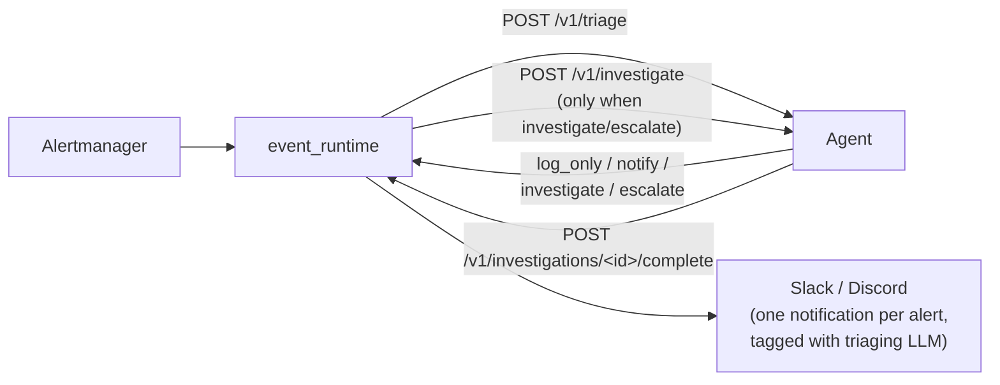
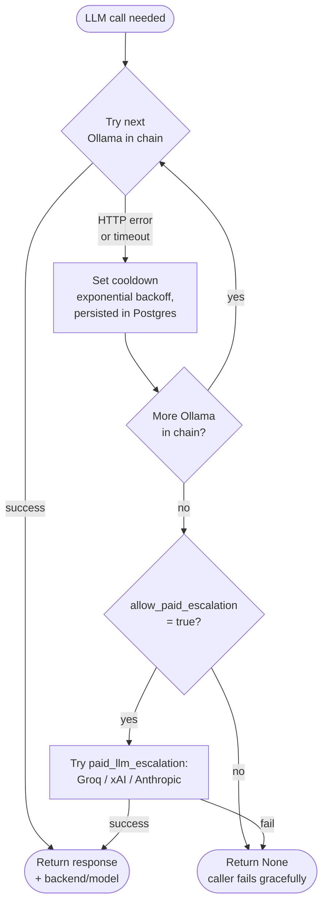

# CFOperator — a self-hosted AI SRE agent

**Despite the name, this is not a Kubernetes operator.** It is a self-hosted
agent that watches your infrastructure, investigates alerts with an LLM, and
proposes fixes as pull requests. It runs on your hardware against your
Prometheus, and it never sends your telemetry to anyone — including us. There is
no phone-home, no version ping, no usage analytics.

**v1.0.8**

## What it actually does

```
alert → triage → investigate → propose a fix → open a GitOps PR → verify after merge
```

Each step is real and running in production:

- **Triage** — every Alertmanager alert is classified `log_only` / `notify` /
  `investigate` / `escalate` by a local LLM, so only the alerts that deserve one
  cost you an investigation.
- **Investigate** — the agent queries Prometheus, Loki, Kubernetes and Docker
  through a tool loop, checks the finding against past investigations held in a
  pgvector knowledge base, and writes a verdict.
- **Propose** — for the fix classes it understands, it produces a concrete diff
  against your manifest repo.
- **Open a PR** — and stop there. **It never mutates a running cluster.** The
  merge button is the deploy path and it stays a human's. This is a deliberate
  design limit, not a missing feature.
- **Verify** — after the merge it checks whether the thing it claimed to fix is
  actually healthy, and downgrades its own verdict if not.

It also runs a proactive sweep every 30 minutes rather than waiting to be
paged, and answers questions in chat, Slack, or any MCP host.

**Requirements:** Prometheus and Alertmanager. Loki for logs. An LLM — a local
Ollama model is the default and the tested path; cloud providers work as a
fallback chain. Supported integrations are listed honestly in
[docs/infrastructure-config.md](docs/infrastructure-config.md) — the list is
short, and that page says so.

## Architecture

The deployed system runs as two processes that split responsibilities along a clean HTTP boundary:

- **`event_runtime`** (separate process / pod) — ingests alerts from Alertmanager, applies dedupe/cooldown policies, runs the decision engine, dispatches actions, and owns the notification surface (Slack, Discord).
- **`agent`** (this codebase's main process) — runs LLM-driven investigations, owns the knowledge base + embeddings, runs the proactive deep sweep, and serves the chat UI.

Two additional sibling deployments reuse the same image and expose the agent to conversational surfaces:

- **`mcp_server`** — a standard [MCP](https://modelcontextprotocol.io/) facade over the agent API (11 tools, 4 resources, 9 skill prompts — one per `skills/*/SKILL.md`) with bearer auth + scope tiers (`read` ⊂ `investigate` ⊂ `remediate`) and a structured audit log, consumable by Claude Desktop/Code, Cursor, or any MCP host. See [docs/mcp-server.md](docs/mcp-server.md).
- **`bridge`** — a Slack Socket Mode bot (`@cfoperator` mentions/DMs, threaded conversations, `investigate:` enqueue, per-message `claude:` model escalation) with pluggable runtimes: `local` (agent chat API, free) or `anthropic` (Claude drives the MCP server's tools). See [docs/slack-bridge.md](docs/slack-bridge.md).

The console on `:8083` authenticates against database-backed accounts with `admin` / `member` roles, plus individually revocable API tokens carrying the same `read` ⊂ `investigate` ⊂ `remediate` scopes. Admins manage users, tokens, and LLM settings at `/admin`; everyone manages their own password and tokens at `/account`. See [docs/auth.md](docs/auth.md).

When an alert arrives, `event_runtime` asks the agent's LLM to **triage** it into `log_only` / `notify` / `investigate` / `escalate`. Only `investigate` and `escalate` trigger a full LLM investigation: the runtime POSTs the alert to the agent's `/v1/investigate`, the agent enqueues, runs the LLM investigation with tools, and POSTs the completed `ActionResult` back to `event_runtime` at `/v1/investigations/{alert_id}/complete`, which fires the single Slack notification with the real outcome (tagged with the LLM that triaged it, e.g. `triaged by ollama/qwen3-coder:latest`). See [docs/event-runtime-quickstart.md](docs/event-runtime-quickstart.md) for the full flow + env vars (`CFOP_AGENT_URL`, `CFOP_COMPLETION_SHARED_SECRET`).



```
CFOperator agent (Docker container)
├── OODA Loop
│   ├── HTTP-driven investigations: POST /v1/investigate from event_runtime
│   ├── Proactive: Deep sweeps every 30min
│   ├── LLM Judge: Verify findings before reporting
│   └── Morning: TPS reports at 7-9 AM
│
├── Knowledge Base (ResilientKnowledgeBase)
│   ├── PostgreSQL + pgvector (persistent storage + semantic search)
│   ├── Embeddings: nomic-embed-text via Ollama (768 dims, HNSW index)
│   └── Offline Buffer: JSON Lines fallback
│
├── Observability (pluggable interface; this is the whole shipped list)
│   ├── Metrics: Prometheus
│   ├── Logs: Loki
│   ├── Alerts: handled by event_runtime (Alertmanager → /v1/investigate)
│   ├── Containers: Kubernetes + Docker + Prometheus bare-metal discovery
│   └── Notifications: handled by event_runtime (Slack + Discord + ntfy)
│
├── LLM Fallback Chain
│   └── Configured Ollama instances (in priority order) → optional paid escalation
│       (one of: Groq, xAI Grok, Anthropic) when allow_paid_escalation=true
│
├── Tools
│   ├── Core: prometheus_query (auto-corrects common PromQL), loki_query
│   │         (validates LogQL), docker_list, docker_inspect, store_learning,
│   │         find_learnings, get_sweep_report, web_search, ...
│   ├── SSH (9): execute, check_service, restart_service, get_logs,
│   │           list_services, docker_list, docker_restart, get_system_info, check_port
│   ├── K8s (16): get_pods, get_pod_logs, get_deployments, rollout_restart,
│   │            rollout_status, get_events, get_nodes, get_node_metrics,
│   │            get_services, get_ingresses, get_namespaces, get_cluster_info,
│   │            get_pod_status, get_all_unhealthy, exec_pod, describe
│   ├── Git (5): recent_commits, diff_summary, show_file, blame, log_path
│   ├── GitHub (9): list_recent_prs, get_pr, list_recent_commits, get_issue,
│   │              search_issues, get_file_contents, compare_commits,
│   │              create_pr, create_issue_comment
│   ├── TimescaleDB (1): timescale_query — read-only SQL over the telemetry
│   │              database (`sensors`) where telegraf lands every MQTT message
│   │              plus the flood/river history. Single SELECT/WITH only, on a
│   │              read-only role and read-only transaction, with a statement
│   │              timeout and row cap. Enabled only when `TIMESCALE_PASSWORD`
│   │              is set — otherwise the tool is not registered.
│   └── Discovery (4): ping_host, verify_ssh, verify_sudo, discover_all_hosts
│
├── Skills (9 workflows)
│   ├── /investigate-host — Systematic host/server investigation
│   ├── /investigate-container — Systematic container investigation
│   ├── /investigate-pod — Kubernetes pod investigation
│   ├── /investigate-deployment — Kubernetes deployment investigation
│   ├── /investigate-code-change — Correlate alerts with recent git changes
│   ├── /k3s-cluster-health — Full cluster health check
│   ├── /why-restart — Analyze container restart causes
│   ├── /compare-hosts — Compare metrics across fleet
│   └── /mqtt-top-talkers — Rank IoT/MQTT devices by telemetry volume
│                            (one timescale_query call)
│
└── Web UI (Dark theme, Inter + JetBrains Mono)
    ├── Chat interface (HTTP polling; WebSocket code present but disabled — Waitress WSGI limitation)
    ├── Collapsible sidebar (skills, chat history)
    ├── Admin panel for LLM / OODA / pool configuration
    ├── Sweep findings panel with severity badges
    └── Status bar (connection, uptime, last sweep)
```

### LLM Fallback Chain

Every LLM-driven action (triage, investigation, learning extraction, …) routes through a fallback manager keyed on the `llm_fallback_chain` setting in the DB. The chain is an ordered list of Ollama hosts; failure or active cooldown advances to the next entry. If every local provider is exhausted *and* `allow_paid_escalation=true`, the single configured `paid_llm_escalation` provider is tried last. Cooldowns are persisted in `llm_provider_state` (Postgres) with exponential backoff, so a flapping Ollama host won't be re-hit every alert. The provider that actually served each call is surfaced back into Slack notifications (`triaged by …`).



## Knowledge Base & Semantic Search

CFOperator learns from every investigation. Findings, root causes, and remediation steps are stored in PostgreSQL and embedded via Ollama (`nomic-embed-text`, 768 dims) into pgvector with an HNSW index for cosine similarity search.

When a new alert fires or a sweep surfaces a finding, the agent queries the knowledge base for similar past incidents — so it can reuse proven remediation steps instead of reasoning from scratch every time.

**Components:**
- **`agent/knowledge_base.py`** — `ResilientKnowledgeBase` wrapping PostgreSQL + pgvector, with offline JSON Lines fallback when the DB is unreachable
- **`agent/embedding_service.py`** — Embedding generation via Ollama's `/api/embeddings`, with in-memory LRU cache and DB-backed cache for cross-session dedup
- **Hybrid search** — combines pgvector cosine similarity with PostgreSQL full-text search (`tsvector`) for best-of-both retrieval

## Sweep Finding Verification (LLM Judge)

Sweep models sometimes hallucinate findings — e.g., reporting "immich-ml container is missing" when `immich_machine_learning` is running fine (name mismatch). To prevent false findings from cascading into false correlations and polluting the knowledge base, a verification step runs after each sweep.

**How it works:**
1. Each sweep phase is required to include an `evidence` field — the specific tool output supporting the finding
2. After dedup, an LLM judge reviews each finding against its evidence
3. Findings where the evidence contradicts the claim, is missing, or has name mismatches are filtered out
4. Only verified findings reach report generation, notifications, storage, and correlation

**Graceful degradation:** If the judge LLM call fails, original findings pass through unmodified.

**Logs:** Look for `"Finding verification: N → M (K filtered)"` to see the judge in action.

## Example Fleet

| Host | Address | Role | Services |
|------|---------|------|----------|
| primary | 10.0.0.10 | primary | Prometheus, Loki, PostgreSQL |
| worker-1 | 10.0.0.11 | worker | node_exporter, promtail, Docker |
| worker-2 | 10.0.0.12 | worker (CFOperator host) | node_exporter, promtail, Docker |
| worker-3 | 10.0.0.13 | worker | node_exporter, promtail, Docker |
| gpu-host | 10.0.0.14 | gpu | Ollama, Alertmanager |

## Quick Start

From clone to a completed investigation. You need Docker, a Prometheus, and an
LLM — Ollama locally, or an API key.

```bash
cp .env.example .env          # three values matter; the rest have defaults
docker compose up -d          # postgres + agent + event-runtime + console
```

The stack seeds itself on first boot: it creates an admin, mints the service
token event_runtime needs, and generates a session secret. Nothing to configure
by hand, and no `config.yaml` to author — the trial ships its own.

```bash
docker compose logs bootstrap | grep password    # your generated admin password
open http://localhost:8083                       # log in as `admin`
```

Then put a real alert through it:

```bash
./scripts/demo-alert.sh
```

The script asks *your* Prometheus what is actually true and builds the alert
from that — a genuinely down target if you have one, otherwise a verification
task about a healthy one. It is deliberately not a fabricated Kubernetes alert:
a trial has no cluster, so that can only ever end in "I could not check".

You get triage, a real investigation, and the line that matters:

```
  investigation #2 -> resolved  (9 tool calls, 48s)
  model: ollama/gemma4:26b
  recommendation: No action needed

      cfassist attach 2
```

That last command drops you into a terminal session **already briefed** on the
investigation — the same line CFOperator puts on every Slack, Discord and ntfy
notification, so an alert is one paste away from context. See
[docs/cockpit.md](docs/cockpit.md).

Running on Kubernetes instead, or wiring your own fleet? See
[docs/DEPLOYMENT.md](docs/DEPLOYMENT.md) and
[docs/config-reference.md](docs/config-reference.md). The SSH host inventory,
Timescale, MCP and the deep-investigation tier are all optional overlays — none
of them are needed to investigate your first alert.

## Usage

**Chat UI**: `http://<cfoperator-host>:8083`

```
"summary"                          → Overnight TPS report
"Why did immich restart last night?" → Targeted investigation
"Show me worker-1 container status" → Fleet query
/investigate-host raspberrypi2      → Host-level investigation
/investigate-container telegraf     → Container investigation
/why-restart immich-ml              → Root cause analysis
/compare-hosts                      → Fleet comparison
/mqtt-top-talkers                   → Chattiest MQTT devices (TimescaleDB)
```

## Key Endpoints

| Endpoint | Description |
|----------|-------------|
| `/` | Chat UI |
| `/api/health` | Health check + uptime |
| `/api/chat` | HTTP chat API (polling; WebSocket disabled) |
| `/api/sweep` | Trigger deep system sweep (POST) |
| `/api/config/reload` | Hot-reload config (POST) |
| `/api/ollama/models` | List available Ollama models |
| `/api/ollama/models/select` | Persist model selection (POST) |
| `/api/qa` | **Removed** — replaced by chat sessions (`/api/chat-sessions`) |
| `/v1/investigate` | POST — async investigation entry point called by event_runtime |
| `/v1/triage` | POST — synchronous triage decision (log_only/notify/investigate/escalate) |
| `/metrics` | Prometheus metrics |
| `/ws` | WebSocket chat (code present, disabled at runtime) |

## cfassist (Go CLI)

A standalone single-binary CLI assistant for SRE and systems administration. Cross-compiles to any platform — no Python or runtime dependencies needed.

### Install

```bash
# Download the latest release (pick your platform)
gh release download cfassist-v0.7.1 -R aachtenberg/cfoperator --pattern 'cfassist-linux-arm64'
chmod +x cfassist-linux-arm64
sudo mv cfassist-linux-arm64 /usr/local/bin/cfassist

# Available binaries: linux-amd64, linux-arm64, linux-arm, darwin-amd64, darwin-arm64
```

### Configure

cfassist reads `~/.cfassist/config.yaml` on startup:

```yaml
llm:
  provider: ollama
  url: http://localhost:11434
  model: llama3:8b
  temperature: 0.7
  context_window: 8192

tools:
  bash:
    enabled: true
    timeout: 30
  read_file:
    enabled: true
    max_lines: 500
```

### Usage

```bash
# Interactive TUI
cfassist

# One-shot mode
cfassist "what is my hostname?"

# Pipe mode
journalctl -u nginx --since '1 hour ago' | cfassist "summarize errors"

# Attach to a CFOperator investigation — the alert-to-terminal handoff.
# Every Slack/Discord/ntfy notification that carries an investigation ends
# with this exact line. See docs/cockpit.md.
cfassist attach 1889
cfassist attach 1889 --print                  # briefing only, no session
cfassist attach 1889 "did the pod recover?"   # one-shot, briefing seeded
```

### CLI Flags

| Flag | Description |
|------|-------------|
| `--config` | Path to config file (default `~/.cfassist/config.yaml`) |
| `--model` | Override LLM model |
| `--provider` | Select LLM provider by name |
| `--url` | Override LLM endpoint URL |
| `--version` | Show version |
| `--print` | (`attach` only) render the briefing to stdout and start nothing |

`attach` reads the CFOperator API over `CFOP_AGENT_URL` / `CFOP_API_TOKEN` — the
same variables the MCP server uses — or a `cfoperator:` block in the config file.
It is read-only: a `read`-scope token is enough.

### Build from Source

```bash
cd cfassist-go
make build          # native binary
make linux-arm64    # cross-compile for Pi
make all            # all platforms
```

## Key Files

| File | Purpose |
|------|---------|
| `agent/agent.py` | OODA loop (proactive sweep + HTTP-driven `run_investigation`), chat handler, tool registry |
| `web_server.py` | Flask + Waitress; REST + WebSocket APIs + `POST /v1/investigate` for event_runtime delegation |
| `event_runtime/` | Standalone process: alert ingest, dedupe, decisions, action dispatch, Slack/Discord |
| `mcp_server/` | MCP facade over the agent API: tools/resources/prompts, bearer auth + scopes, audit log ([docs](docs/mcp-server.md)) |
| `bridge/` | Slack Socket Mode bot with pluggable runtimes (local agent / Claude-over-MCP) ([docs](docs/slack-bridge.md)) |
| `event_runtime/http_actions.py` | `HTTPInvestigateActionHandler` + completion endpoint auth/validation helpers |
| `auth/` | Console users, roles, and API tokens: models, store, routes, bootstrap ([docs](docs/auth.md)) |
| `web_auth.py` | Console gate on `:8083`: session login, bearer verification, `require_role` |
| `ui/index.html` | Single-page chat UI (dark theme, sidebar layout) |
| `ui/account.html` | Self-service password and own API tokens |
| `ui/admin.html` | Admin panel: users, tokens, LLM runtime config |
| `agent/knowledge_base.py` | ResilientKnowledgeBase wrapping PostgreSQL + pgvector |
| `agent/embedding_service.py` | Embedding generation via Ollama with LRU + DB cache |
| `agent/llm_fallback.py` | LLM provider chain with cooldown/retry |
| `config.yaml.example` | All URLs, host definitions, OODA timing |
| `tools/` | SSH, K8s, git, GitHub, TimescaleDB, discovery, and core tool implementations |
| `tools/timescale.py` | Read-only SQL over the telemetry TimescaleDB (`timescale_query`) |
| `executor/` | Disposable Job that carries a remediation to a PR ([docs](docs/REMEDIATION.md)) |
| `changerecord/` | Change-record microservice for the node-action lane ([docs](docs/REMEDIATION.md)) |
| `worker/` | Deep-investigation worker + forensics templates ([docs](docs/deep-investigation.md)) |
| `scripts/` | Operator scripts shipped in the image (`create_admin.py`, `mcp_smoke.py`) |
| `.github/workflows/tests.yml` | pytest suites on every PR and push to `main` |
| `.mcp.json` | Dev-tooling MCP servers for agentic sessions in this repo (Plane, workspace `cfoperator`; needs `PLANE_API_KEY` in the environment) |
| `skills/` | Investigation workflow definitions (SKILL.md) |
| `observability/` | Pluggable backends (Prometheus, Loki, Kubernetes, Docker, Slack, Discord) |
| `llm-gateway/` | Go proxy with health-based routing + fallback |
| `benchmarks/` | Inference latency benchmarks (TTFT, tokens/sec) |
| `grafana/` | Dashboard JSON + upload script |

## Tests & CI

[`.github/workflows/tests.yml`](.github/workflows/tests.yml) runs the pytest
suites on every pull request and on pushes to `main` (plus `workflow_dispatch`).

The suite cannot run as one flat `pytest`: several trees ship a top-level module
of the same name (`nodeaction`, `entrypoint`, `server`), and most directories use
bare imports that need their own directory on `sys.path`. CI therefore runs one
pytest invocation per directory with `PYTHONPATH=<dir>:<repo-root>` — mirror that
locally:

```bash
# per-package suites
for d in agent tools event_runtime executor changerecord worker mcp_server/tests bridge/tests; do
  PYTHONPATH="$PWD/$d:$PWD" python -m pytest "$d"
done

# observability and auth use absolute imports — repo root only, so their
# docker.py / tokens.py don't shadow real packages
PYTHONPATH="$PWD" python -m pytest observability auth

# hermetic root-level suites
PYTHONPATH="$PWD" python -m pytest \
  test_web_auth.py test_web_auth_db.py test_auth_integration.py \
  test_dockerfile_image.py test_http_investigate.py test_k8s_probe_filter.py \
  test_triage_engine.py test_github_integration.py test_event_runtime.py
```

`test_tool_calling.py` is deliberately excluded from CI — it needs a live LLM and
fails at fixture setup without one.

## Documentation

### Getting Started
- [README.md](README.md) — This file (architecture, quick start)
- [docs/DEPLOYMENT.md](docs/DEPLOYMENT.md) — Deploy checklist and quick commands
- [docs/infrastructure-config.md](docs/infrastructure-config.md) — Fleet configuration
- [docs/event-runtime-quickstart.md](docs/event-runtime-quickstart.md) — Alert ingest → triage → investigate flow, env vars

### Interfaces
- [docs/auth.md](docs/auth.md) — Console users, roles, API tokens, lockout/rotation runbooks
- [docs/mcp-server.md](docs/mcp-server.md) — MCP facade: tools, resources, prompts, scopes, host setup
- [docs/slack-bridge.md](docs/slack-bridge.md) — Slack Socket Mode bot and its runtimes
- [docs/mcp-server-plan.md](docs/mcp-server-plan.md) — MCP design/contract and phase history

### Remediation & Investigation
- [docs/REMEDIATION.md](docs/REMEDIATION.md) — Remediation lifecycle, executor, change records
- [docs/remediation-pipeline.md](docs/remediation-pipeline.md) — Pipeline internals
- [docs/deep-investigation.md](docs/deep-investigation.md) — Deep-investigation worker
- [docs/noise-reduction.md](docs/noise-reduction.md) — Dedupe/cooldown policy

### Operations & Monitoring
- [docs/METRICS.md](docs/METRICS.md) — Prometheus metrics reference
- [docs/OBSERVABILITY.md](docs/OBSERVABILITY.md) — Observability surfaces
- [grafana/README.md](grafana/README.md) — Grafana dashboard guide
- [docs/llm-observability.md](docs/llm-observability.md) — LLM metrics deep dive
- [docs/ROADMAP.md](docs/ROADMAP.md) — Planned work

### Benchmarks
- [benchmarks/results.md](benchmarks/results.md) — Ollama inference latency benchmark (TTFT, tokens/sec, GPU stats)
- [docs/ollama-tool-calling-benchmark.md](docs/ollama-tool-calling-benchmark.md) — Multi-host tool calling benchmark
- [docs/local-llm-benchmark.md](docs/local-llm-benchmark.md) — Local model comparison

## Accuracy Notes (README vs. Code)

- **Skills**: 9 loaded at runtime — the 8 investigation playbooks plus `mqtt-top-talkers`. The MCP server registers one prompt per skill, so its prompt count tracks this number automatically.
- **`timescale_query`**: Registered only when `TIMESCALE_PASSWORD` is set. Without it the agent logs `TIMESCALE_PASSWORD not set - timescale_query tool disabled` and `mqtt-top-talkers` has nothing to call.
- **WebSocket**: Code exists (`/ws`) but `WEBSOCKET_AVAILABLE=False` at runtime because Waitress (WSGI) does not support it; UI uses HTTP polling via `/api/chat`.
- **`/api/qa`**: Endpoint removed; replaced by chat session management (`/api/chat-sessions`).
- **Morning summary**: Runs 7-9 AM local time (configurable), authored by the cheap primary model; LLM Judge verification applies to sweep findings only.

## License

MIT — see [LICENSE](LICENSE).
