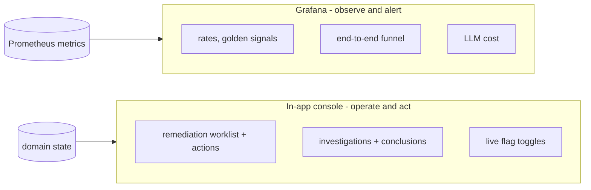

# CFOperator observability

Two purpose-scoped surfaces — **never one holistic dashboard**:

Boundary rule: **a trend or a number you'd graph/alert on → Grafana; a row you'd
read or a button you'd click → console.** Neither tries to be the other.

## Patterns applied

- **Four Golden Signals** (latency/traffic/errors/saturation) — default lens
- **RED** (rate/errors/duration) for request-like work (triage, investigations, LLM)
- **USE** (utilization/saturation/errors) for resources (fleet, queue)
- **Work-queue / Little's Law** (`L = λW`) for the remediation queue
- **Funnel / conversion** for the end-to-end agent — drop-off per stage

## Grafana (status: built)

- **`CFOperator — Remediation`** (`cfop-remediation.json`, homelab-infra) — work-queue
  pattern (depth by status, arrival λ by source/class, outcomes μ, executor spawns,
  reaper) **+ the end-to-end funnel** (alerts → triage→investigate → investigations
  → needs_action → queued → auto-eligible → resolved) + a Loki logs panel.
- **`CFOperator — Fleet`** (the former 66-panel board) — slimmed; bolted-on
  remediation tiles removed.
- Datasources: Prometheus `cf6z7j8gxto1sc`, Loki `cfawbn0oyoqv4f`. Provisioned via
  `k3s/base/monitoring/kustomization.yml`; Grafana sidecar reloads on ConfigMap change.

**Not built (deferred, low value):** a separate top-level Overview board and the
Investigations/LLM/Triage drilldowns carved out of the fleet board.

## In-app console (status: built, `:8083`)

- **`/remediations`** — worklist (open items up top, **Closed (resolved/rejected)
  below a divider**), status/risk badges, detail drawer with the proposed diff/PR;
  actions: approve / reject / reclassify (class·risk·repo); pipeline bar with live
  `feed/drain/reap/verify` toggles + run-feed; toasts, click-away dismiss.
- **`/investigations`** — outcome-filtered list + drill into each one's
  recommendation/findings (read what the agent concluded).
- Both theme-matched to the main UI; logo links home; cross-linked.

## Metrics

Emitted by the agent (`agent/agent.py`, prometheus_client) + event_runtime
(`event_runtime/telemetry.py`).

| metric | use |
|---|---|
| `cfoperator_remediation_queue{status}` | queue depth (gauge) |
| `cfoperator_remediation_enqueued_total{source,class,eligible}` | arrival rate λ |
| `cfoperator_remediation_executor_spawned_total{result}` | drain activity |
| `cfoperator_remediation_outcome_total{outcome}` | terminal outcomes μ |
| `cfoperator_remediation_reaped_total` | dead-lease recoveries |
| `cfoperator_investigations_total{outcome}` | investigation funnel stage |
| `cfoperator_event_runtime_alerts_received_total` / `decisions_total{action}` | funnel head |
| `cfoperator_llm_*` | LLM RED + cost |

Reading domain state: use the console / read APIs (`GET /api/remediations`,
`GET /api/investigations`) — not psql.
