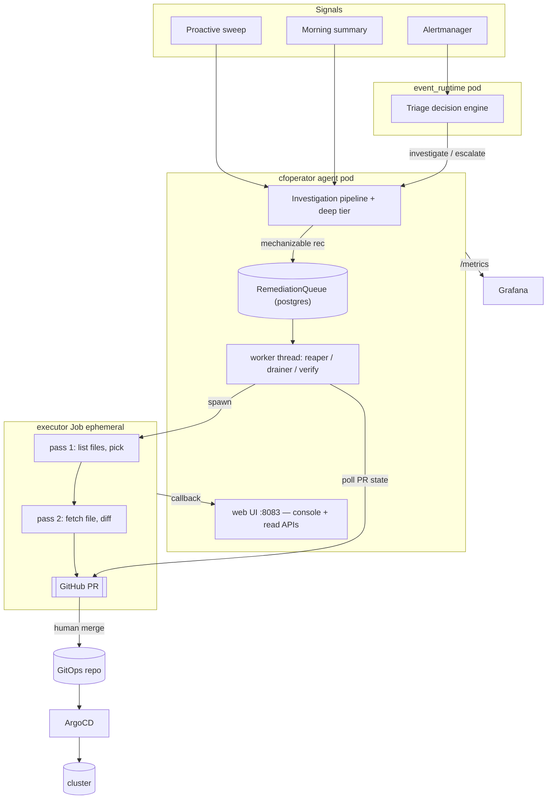
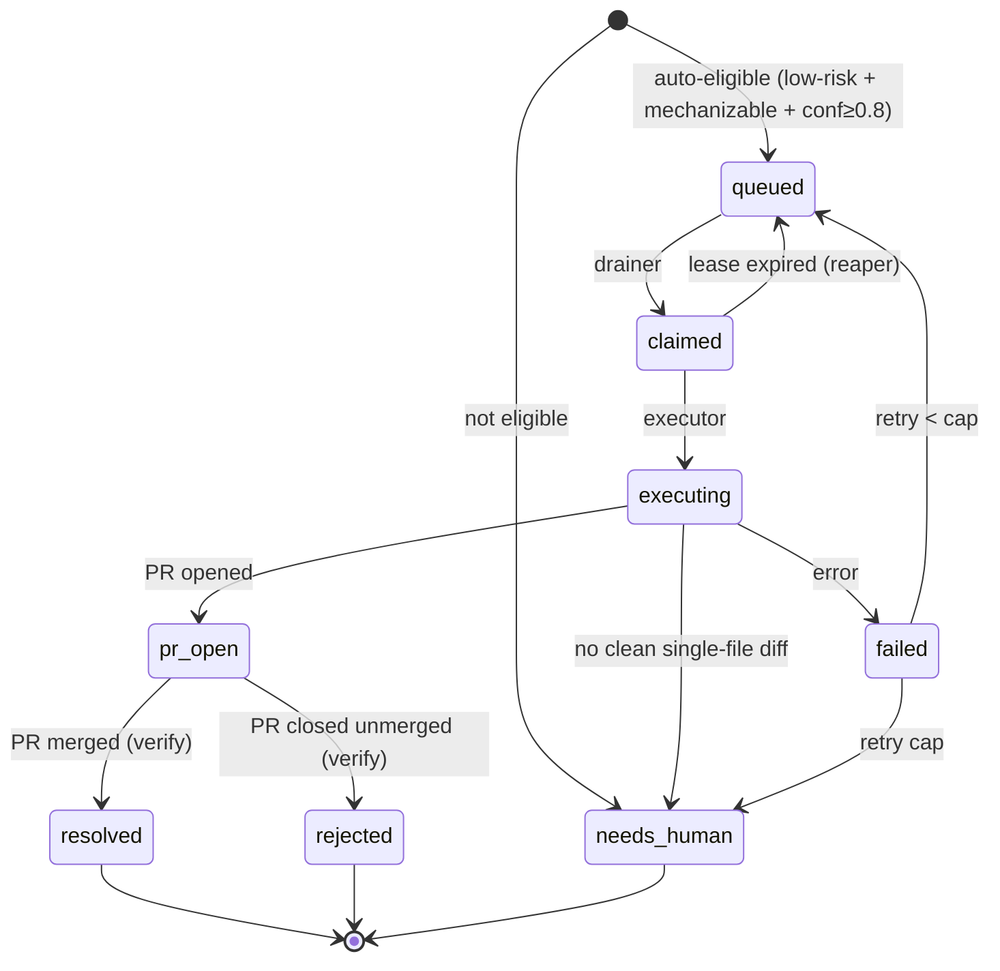

# Remediation & auto-heal

How CFOperator turns an observed problem into an autonomous (human-gated) fix.
Read-only toward the cluster end to end — the **only** mutation is a GitHub PR a
human merges, which ArgoCD then syncs.

## TL;DR

- Findings (alerts, proactive sweeps, the morning summary) are **triaged**.
- Anything the agent can look into itself becomes an **autonomous investigation**
  (logs/metrics/Loki/ssh) → a real outcome: `resolved` / `monitoring` /
  `escalated`, or a concrete recommendation.
- A *mechanizable* recommendation is enqueued on the **remediation queue**; the
  drainer hands it to a **file-aware executor Job** that opens a **PR**.
- You merge → ArgoCD syncs → the **verify** reconciler closes the loop to
  `resolved`. Genuinely human work (hardware, wiring, judgement) → `needs-human`.

Principle the design enforces: **don't punt to a human what the agent can
investigate or mechanize itself.** `needs-human` is the exception, not the dumping ground.

## Architecture



**Process topology:** `agent` and `event_runtime` are separate pods sharing one
postgres and one image; the **executor** and deep-investigation **worker** are
ephemeral Jobs (separate images). The drainer runs in the agent; the agent SA has
`batch/jobs` create; the executor SA is read-only.

## End-to-end flow

```mermaid
sequenceDiagram
  participant S as Signal (alert/sweep/summary)
  participant A as Agent
  participant Q as RemediationQueue
  participant X as Executor Job
  participant H as Human
  participant G as ArgoCD
  S->>A: finding
  A->>A: investigate (logs/metrics/ssh) → outcome
  alt mechanizable fix
    A->>Q: queue_remediation(class, risk, conf, repo)
    Q->>X: drainer claims (auto-gate) + spawns
    X->>X: pass1 pick file · pass2 diff vs real content
    X->>H: open PR
    H->>G: merge
    G-->>A: synced; verify reconciler → resolved
  else investigate-shaped
    A->>A: autonomous investigation → resolved/monitoring/escalated
  else genuinely human
    A->>Q: needs-human (tracked, not auto-acted)
  end
```

## Remediation queue state machine



## Components

- **RemediationQueue** (`agent/knowledge_base.py`) — postgres table + ops
  (`queue_remediation`, `claim_next_remediation`, `update_remediation_status`,
  `fail_remediation`, `requeue_stale_remediations`, `reclassify_remediation`,
  `list/get/count`). Pure auto-gate: `remediation_is_auto_eligible`.
- **Feeds** → the queue / investigation pipeline:
  - deep-investigation results carrying `remediation_class` (`_maybe_queue_remediation`)
  - morning-summary **structured recommendations** (`_feed_remediations_from_summary`),
    with raw sweep-finding fallback; `investigate`-class recs are **dispatched as
    autonomous investigations**, not queued as needs-human
  - manual operator-authored: `POST /api/remediations`
- **Worker thread** (`_remediation_worker_loop`) — reaper · drainer · verify, off
  the OODA loop so a long sweep can't starve them.
- **Executor Job** (`executor/`) — portable, stdlib-only, model-swappable
  (`CFOP_EXEC_LLM_BACKEND` = anthropic | openai-compat | claude-cli). **File-aware
  two-pass**: list repo manifests → LLM picks the file → fetch real content → LLM
  diffs against it → `open_pr_from_diff`. Per-item target repo (`payload.repo`).
  Read-only toward the cluster; slim image (~43 MB).
- **Callback** — executor → `POST /v1/remediations/<id>/complete` → drives the row.
- **Console + read APIs** — see [OBSERVABILITY.md](OBSERVABILITY.md).

## Flags

Resolve **DB setting (`kb.set_setting remediation_<flag>`) → config.yaml**, so
they toggle live (no redeploy) from the console pipeline bar.

| flag | effect |
|---|---|
| `queue_feed` | enqueue remediations from findings |
| `queue_drain` | claim queued items + spawn executors (opens PRs) |
| `queue_reap` | recover dead executor leases |
| `queue_verify` | advance `pr-open` rows by PR merge/close |

Auto-execute gate (enqueue → `queued` vs `needs-human`): class ∈
{`gitops-patch`,`k8s-action`} **and** `risk == low` **and** `confidence ≥ 0.8`.

## Safety model

Single-file diffs only (multi-file → `needs-human`), exact-context apply (drift →
decline), secret-path refusal, branch dedupe, per-tick + retry caps, read-only
executor SA, and **human merge is the only mutation path**.

## Deploy

CI (`build-cfoperator-main.yml`) builds `cfoperator`, `cfoperator-worker`,
`cfoperator-executor`. RBAC + config live in the private `cfoperator-deploy`
repo: `cfoperator-executor` read-only SA, the `remediation:` config block, and
`cfoperator-secrets` (`GITHUB_TOKEN`, `ANTHROPIC_API_KEY`,
`CFOP_COMPLETION_SHARED_SECRET`). After an executor code change, wait for the
`build-executor` job before re-queuing (else the Job pulls the prior `:main`).

## Operate

- Console: `:8083/remediations` (worklist + actions + flag toggles),
  `:8083/investigations` (outcomes + drill).
- APIs: `GET /api/remediations[/<id>]`, `GET /api/investigations[/<id>]`,
  `POST /api/remediations` (create), `.../<id>/{approve,reject,reclassify}`,
  `GET/POST /api/remediation/flags`, `POST /api/remediation/run-feed`.

## Known gaps

- Executor declines genuinely multi-file fixes (single-file gate) → `needs-human`.
- Orphaned `in_progress` investigations after a pod roll (in-memory queue) — a
  startup reaper for stale rows would mop these up (not yet built).
