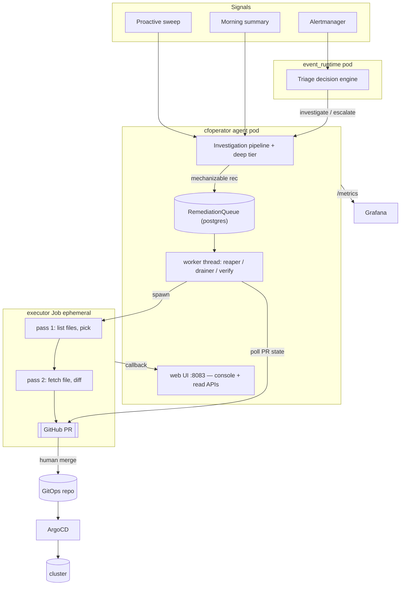
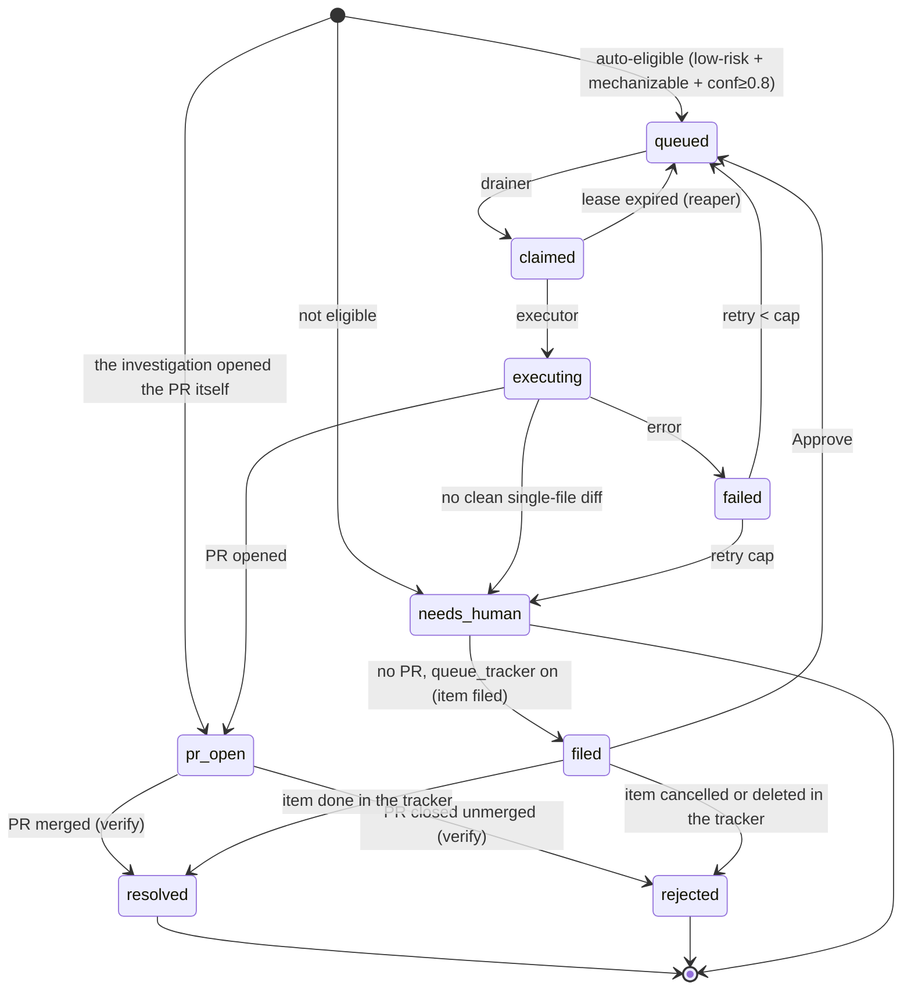

# Remediation & auto-heal

How CFOperator turns an observed problem into an autonomous (human-gated) fix.
Read-only toward the cluster end to end — the **only** mutation is a GitHub PR a
human merges, which ArgoCD then syncs.

## TL;DR

- Findings (alerts, proactive sweeps, the morning summary) are **triaged**.
- Anything the agent can look into itself becomes an **autonomous investigation**
  (logs/metrics/Loki/ssh) → a real outcome: `resolved` / `monitoring` /
  `escalated`, or a concrete recommendation.
- A *mechanizable* recommendation is enqueued on the **remediation queue**; the
  drainer hands it to a **file-aware executor Job** that opens a **PR**.
- You merge → ArgoCD syncs → the **verify** reconciler closes the loop to
  `resolved`. Genuinely human work (hardware, wiring, judgement) → `needs-human`.

Principle the design enforces: **don't punt to a human what the agent can
investigate or mechanize itself.** `needs-human` is the exception, not the dumping ground.
And when a row *is* for a human, it should not sit in the console inviting
another round with the LLM: with `queue_tracker` on, a parked row with no PR is
**filed to an issue tracker** and moves to `filed` — groomed or discarded over
there, and the row follows (CFOP-170).

## Architecture



**Process topology:** `agent` and `event_runtime` are separate pods sharing one
postgres and one image; the **executor** and deep-investigation **worker** are
ephemeral Jobs (separate images). The drainer runs in the agent; the agent SA has
`batch/jobs` create; the executor SA is read-only.

## End-to-end flow

```mermaid
sequenceDiagram
  participant S as Signal (alert/sweep/summary)
  participant A as Agent
  participant Q as RemediationQueue
  participant X as Executor Job
  participant H as Human
  participant G as ArgoCD
  S->>A: finding
  A->>A: investigate (logs/metrics/ssh) → outcome
  alt mechanizable fix
    A->>Q: queue_remediation(class, risk, conf, repo)
    Q->>X: drainer claims (auto-gate) + spawns
    X->>X: pass1 pick file · pass2 diff vs real content
    X->>H: open PR
    H->>G: merge
    G-->>A: synced; verify reconciler → resolved
  else investigate-shaped
    A->>A: autonomous investigation → resolved/monitoring/escalated
  else genuinely human
    A->>Q: needs-human (tracked, not auto-acted)
  end
```

## The FIX contract

Everything above starts with one object. An investigation that ends
`needs_action` is asked to emit a **FIX** beside its prose recommendation — a
typed description of the change it is proposing. The FIX is what decides the
remediation's class, risk and confidence; the prose is what a human reads.

Before it existed the queue was fed by classifying free-form English, which is
why several parsers still sit upstream of it (see *Feeds*). The FIX replaces
guessing at a sentence with reading a field.

### Shape

```json
{
  "targets":  [{"kind": "gitops-manifest|k8s-object|k8s-imperative|host|database-row|external-system",
                "id": "path, name, or host",
                "repo": "required as owner/name for gitops-manifest; optional for every other kind"}],
  "observed": [{"source": "the command or file you READ",
                "value":  "what it actually said, verbatim"}],
  "steps":    ["ordered action"],
  "verify":   {"command": "check", "expect": "success signal"},
  "rejected": [{"alternative": "what you considered", "why_not": "why not"}],
  "risk":     "low|med|high"
}
```

`repo` is **conditional**, matching the schema line above. For a
`gitops-manifest` target it is required and must resolve in the git registry:
omitted, empty and unresolvable are all refused alike. For every other kind it
is optional: a resolvable value is kept (it becomes the work-order's repo), and
a value that does not resolve is dropped rather than fatal.

It is read from the region after the **last** `STATUS:` in the reply — a
line-anchored `FIX:` first, then a fenced JSON block, and for a nudge reply
the bare object. (`FIX:` is line-anchored on purpose: a substring match also
hits `hotfix:` and `bugfix:`, then grabs the next `{` — usually findings JSON —
and drops the real FIX further down the same region.)

### What makes one invalid

Validation is **parse-or-None and never fills in a missing field**. A FIX is
refused if:

- `targets` is missing, empty, or any target lacks `kind` or `id`
- `steps` is missing, empty, or any step is not a non-empty string
- `verify` lacks either `command` or `expect`
- any `rejected` entry lacks either `alternative` or `why_not`
- `risk` is present but not one of `low` / `med` / `high`
- **`observed` is missing or empty**, or an entry is not an object, or lacks
  either `source` or `value` — every one of these is logged with its reason
  and the target ids
- a **`gitops-manifest` target has no resolvable `repo`** — omitted, empty, or
  a value absent from the git registry are refused alike

`observed` is required unconditionally rather than only for steps that change a
value. Deciding which steps those are means classifying free-form step text,
and that is the class of parser this contract exists to remove. A
restart-the-pod FIX records the pod's status and restart count, which is
evidence worth having.

The repo rule is a property of the kind, not a policy: the executor's first act
on a manifest patch is to list that repo's files, so an unresolvable repo can
only bounce. Resolution accepts either the registry short name or the
`owner/name` slug and always emits the slug, which is the form the executor
hands to GitHub. For every other kind an unresolvable repo is dropped rather
than fatal — a `host` target is actionable without one.

### What happens when it is invalid

Nothing is salvaged. On a `needs_action` outcome the agent asks **once** more,
with the schema; if that reply is also invalid the recommendation **degrades to
the CFOP-48 classifier** and still reaches the queue. An invalid FIX loses the
typed hints, not the finding.

### What a valid FIX decides

Class comes from the **first** target's kind:

| target kind | remediation class |
|---|---|
| `gitops-manifest` | `gitops-patch` |
| `k8s-object` | `k8s-action` |
| `k8s-imperative` | `k8s-imperative` |
| `host` | `node-action` |
| `database-row` | `data-fix` |
| `external-system` | `external-system` |
| *any other kind* | `manual` |

**That table is a mapping, not a whitelist.** Validation does not constrain
`kind` to the six names — a target kind of `sprocket` produces a perfectly
valid FIX that maps to `manual` and parks for a human. The enum in *Shape* is
guidance to the model, not a check, so a misspelled or future kind degrades
quietly rather than being refused.

Confidence is deliberately stingy. **Only** a single-target `gitops-manifest`
at `risk: low` gets `0.8` — the one shape that can clear the auto gate.
Everything else gets `None` and parks, including every multi-target FIX. The
local primary reports 1.0 on calls it got wrong, so high confidence is not
inferred from the model's own certainty.

That stinginess has a corollary worth stating plainly: **a `k8s-object` FIX can
never auto-execute**. It maps to `k8s-action`, which is not in the default
auto list (CFOP-128) and which the FIX path never stamps a confidence on.
Putting `k8s-action` back in config would still drain a bare object name into
`run_gitops` — that is CFOP-61, not a stamp to add here. So a model that
reaches for `k8s-object` where a manifest edit was meant writes a row that
parks at needs-human with `attempts=0` and no PR — which is what live row #96
did, and why the prompt now says which kind this installation can act on
(below).

### Telling the model how changes are delivered here

Which target kind is *honest* depends on the site, not on the resource. Editing
a Deployment's probes is a `gitops-manifest` change where manifests live in a
repo and a `k8s-object` change where they do not, and the model cannot tell
which from the cluster alone. Before CFOP-148 it was told nothing: the prompt
carried the bare kind enum and no semantics, so on a GitOps fleet it would
reasonably pick `k8s-object` for a Deployment and write `kubectl apply` steps
that describe a delivery path that does not exist there.

`remediation.delivery.mode` supplies the missing half, and is **off by
default** — `none` renders no guidance at all, which is exactly the prompt that
shipped before. `gitops` names the configured repo (resolved through the git
registry, so it is the same slug the executor uses) and steers manifest-
expressible work to `gitops-manifest`; `direct` says there is no manifest repo
and steers to `k8s-object` / `k8s-imperative`. Nothing about a specific syncer
is baked in: `tool` is free text that only shapes wording, and a cluster that
is neither GitOps nor k3s is served by `direct` or by saying nothing.

The same text goes to the FIX nudge retry, or the retry would quietly undo the
steer that produced it. See `docs/config-reference.md` for the block.

Two edges worth knowing:

- **`gitops` with an unresolvable repo renders nothing** (and logs a warning).
  `_validate_structured_fix` refuses a `gitops-manifest` target whose repo is
  missing or unresolvable, so preferring that kind with no repo to name would
  steer the model into a FIX that cannot enqueue — the row would fall through
  to the classifier, which is row #96's path one layer over. A GitOps site
  whose manifest repo does not resolve has no working GitOps lane, and saying
  so in the log beats guidance that goes nowhere.
- **The class rubric reads the same config.** `_REMEDIATION_CLASS_RUBRIC` is
  shared verbatim by the needs_action classifier and the morning summary, and
  it used to name this project's own repos — so those two feeds carried the
  assumption the FIX prompt had just been cleaned of. The rubric proper is now
  site-neutral and `_remediation_class_rubric(config, repos)` appends the site
  line from `remediation.delivery`, so all three prompts agree about where a
  manifest change goes or all three stay quiet.

Two further bars sit in front of an auto-execute:

- A **fork-shaped** recommendation ("do X, or do Y") has its confidence cleared
  even when the FIX looks auto-eligible, because the FIX was parsed from the
  pre-rewrite text and may describe the alternative that was not chosen.
- The **mutation judge** gives a frontier model a veto on anything that would
  auto-execute. It is pinned to its own model floor, so a cost downgrade of the
  executor's model cannot demote the model holding the veto, and it **fails
  closed** — unavailable, unparseable, or raising all park the row.

`targets`, `observed`, `steps`, `verify` and `rejected` ride onto the queue row
and are rendered in the console drawer, so an operator sees the claimed current
state next to the proposed change.

### Limit worth knowing

`observed` is checked for **presence and shape** in `_validate_structured_fix`,
which stays pure. At enqueue, `_check_observed_against_targets` reads
`gitops-manifest` files through the GitHub contents API and compares the
claimed text to those bytes. It does not run `source`.

A quote that occurs in the file is `verified`. A bare assignment
(`MemoryHigh=8G`, `memory: 256Mi`) whose key the file also assigns, and whose
value is not one of the file's, **refuses the FIX**: the refusal is logged and
the recommendation is classified instead of judged. A quote that is neither
(a log line, a pod status, a dotted path) is `unverified`, and the FIX still
enqueues. A failed read, a missing GitHub client, or any kind other than
`gitops-manifest` is also `unverified` — contradiction is only decided when
every gitops-manifest target was actually read.

The queue payload's `observed_check` (`status`, `reason`) is what the drawer
shows, so an unverified claim is not presented as a value that was checked.
The read that fills `observed` is still what puts the file's own comment in
front of the model. k8s, ssh, and database targets are not read here.

## Remediation queue state machine



A PR the investigation opens itself — the model calls `github_create_pr` and
then recommends merging it — enters as `pr-open` carrying the URL, the state the
executor's completion would have produced: the reconciler resolves the row on
merge and rejects it on close, the drainer never claims it, and Approve is
refused while the PR is open, because the executor regenerates its own diff and
would open a second one (CFOP-116). Rows from before that fix show the PR their
recommendation names, when it is in the row's own repo, as `named_pr_url` — a
link for the operator, not a tracked PR: the reconciler, the stamp path and the
Approve gate read the column only.

## Components

- **RemediationQueue** (`agent/knowledge_base.py`) — postgres table + ops
  (`queue_remediation`, `claim_next_remediation`, `update_remediation_status`,
  `fail_remediation`, `requeue_stale_remediations`, `reclassify_remediation`,
  `list/get/count`). Pure auto-gate: `remediation_is_auto_eligible`.
- **Feeds** → the queue / investigation pipeline:
  - deep-investigation results carrying `remediation_class` (`_maybe_queue_remediation`)
  - morning-summary recommendations (`_feed_remediations_from_summary`) — prose,
    not FIX objects; the summary path does not emit a FIX,
    with raw sweep-finding fallback; `investigate`-class recs are **dispatched as
    autonomous investigations**, not queued as needs-human. Mutation-shaped sweep
    recs go through the **CFOP-48 classifier + auto-queue gates** (CFOP-53) —
    only genuinely human-shaped recs enqueue directly as `manual`, and classifier
    degrade/failure falls back to that manual path rather than dropping a finding
  - manual operator-authored: `POST /api/remediations`
- **Worker thread** (`_remediation_worker_loop`) — reaper · drainer · verify ·
  tracker, off the OODA loop so a long sweep can't starve them.
- **Tracker service** (`tracker/`) — stdlib sibling behind the `cfop-tracker`
  Service; one image, `CFOP_TRACKER_BACKEND` = plane | github | jira. The agent's
  `tracker_sync` tick hands parked rows to it and mirrors the outcome back. See
  [Tracker hand-off](#tracker-hand-off-issue-trackers).
- **Executor Job** (`executor/`) — portable, stdlib-only, model-swappable
  (`CFOP_EXEC_LLM_BACKEND` = anthropic | openai-compat | claude-cli). **File-aware
  two-pass**: list repo manifests → LLM picks the file → fetch real content → LLM
  diffs against it → `open_pr_from_diff`. Per-item target repo (`payload.repo`).
  Read-only toward the cluster; slim image (~43 MB).
- **Callback** — executor → `POST /v1/remediations/<id>/complete` → drives the row.
- **Console + read APIs** — see [OBSERVABILITY.md](OBSERVABILITY.md).

## Flags

Resolve **DB setting (`kb.set_setting remediation_<flag>`) → config.yaml**, so
they toggle live (no redeploy) from the console pipeline bar.

| flag | effect |
|---|---|
| `queue_feed` | enqueue remediations from findings |
| `queue_drain` | claim queued items + spawn executors (opens PRs) |
| `queue_reap` | recover dead executor leases |
| `queue_verify` | advance `pr-open` rows by PR merge/close |
| `queue_tracker` | file parked rows to the issue tracker (`needs-human` without a PR → `filed`), mirror PR-open rows, close rows the tracker closed |

Auto-execute gate (enqueue → `queued` vs `needs-human`): class in
`remediation.auto.classes` (default `{gitops-patch}`) **and**
`risk == low` **and** `confidence ≥ remediation.auto.min_confidence` (default
0.8). The list is config, not a code tuple, so adding `node-action` is a
ConfigMap edit (CFOP-131). `k8s-action` left the default (CFOP-128); putting
it back is the CFOP-61 unknown, not a stamp. Park-only classes
(`k8s-imperative`, `data-fix`, `external-system`, `manual`) cannot be added
from config.

A class is auto-eligible only if the executor can run it. `k8s-action` means
"expressible as a manifest edit" — the executor applies it by opening a PR.
`k8s-imperative` (a one-off kubectl verb: create a Job from a CronJob, delete
a pod, cordon a node) is deliberately **not** auto-eligible and has no runner:
it parks `needs-human`, and reaching the executor by human approval fails fast
naming the missing path rather than spending two LLM passes on a diff that
cannot exist. See CFOP-61.

## Imperative lane change records

`node-action` remediations run a gated command plan over SSH. Console approve
still escalates the queue row. For evidence-grade approval, deploy the
**changerecord** microservice (`changerecord/`) and point the agent at it with
`CFOP_EXEC_CHANGE_URL` (also under `remediation.executor.node_action.change_record.url`).

When the URL is **unset**, a `node-action` is **refused**: the row is parked at
`needs-human` naming the setting to configure, and nothing is spawned (CFOP-131).
The record is the only thing between an approved row and shell on a host, and an
unset URL used to be indistinguishable from an approval. Other classes are
unaffected — `gitops-patch` keeps its own human gate, the PR merge, and drains
normally with no recorder configured.

When the URL is **set**:

1. Agent drain generates a concrete command plan (same allowlist the executor
   uses), then opens a record (`POST /open`) stamping that plan + executor
   image + flag snapshot. The plan is what a human merges.
2. Agent polls `GET /approval/{ref}` each tick; spawn is blocked until a named
   identity is returned. Unapproved records never reach `run_ssh_plan`.
3. Executor runs the **approved plan** (skips LLM planning), then `POST /close`
   with per-command results.

### Microservice swap model

One ClusterIP **Service** (`cfop-changerecord`); swap the **Deployment image** to
change backends — github today, snow/jira later. Agent and executor only speak
the 3-endpoint HTTP contract; there is no `github|snow|jira` switch in either.

| image | approval meaning |
|---|---|
| `cfoperator-changerecord` (github) | record PR under `change-records/`; merge = approve |
| snow / jira (later) | ticket state from `CFOP_EXEC_CHANGE_APPROVED_STATE` / `_CLOSED_STATE` on the recorder |

Approved/closed state names stay **env on the recorder Deployment**, not in the
agent or executor.

Auth: when `CFOP_CHANGERECORD_SHARED_SECRET` is set on the recorder, `/open`,
`/approval/{ref}`, and `/close` require `X-CFOP-Token` (same idiom as
`CFOP_COMPLETION_SHARED_SECRET`). `/healthz` stays open. Wire the secret into
the agent Deployment and the executor Job (via `cfoperator-secrets`).

**GitHub close note:** after merge, `close()` commits the outcome onto the
**base** branch (the merged record file). That commit fails under branch
protection on `main` — either allow the recorder bot to push to base, or treat
close as best-effort and rely on the PR conversation / agent result for
evidence until a follow-up lands a PR-based close path.

### Tracker hand-off (issue trackers)

The problem this solves (CFOP-170): a `needs-human` row with no PR produced no
outbound signal and sat in the console's active list, where a human opened it
and iterated with the LLM again — tokens spent on work the pipeline had already
given up on. Now the row is **handed off**.

| row | tracker item | row after |
|---|---|---|
| `needs-human`, no PR | created, **priority low** | `filed` — out of the active list, into the console's *Filed to tracker* section with its key |
| `needs-human` with a PR, or `pr-open` | created, **priority high**, linked to the PR | unchanged; the PR reconciler still owns it |
| `filed`, item marked done in the tracker | — | `resolved` (`result.resolved_by = tracker`) |
| `filed`, item cancelled or deleted | — | `rejected` |
| `filed`, Approve in the console | told "handed to the executor" | `queued` (the usual path; a decline re-parks and re-files) |
| `resolved` / `rejected` in the console | transitioned, with the note | unchanged |

Priority follows the PR, not the risk: a PR is something a human can merge
now; everything else is backlog. `filed` is **non-terminal** on purpose — a
recurrence folds into the filed row (dedupe) instead of filing a second item,
and a recovered node closes a filed row like any other paperwork row.

**Shape.** Same as the change recorder: a stdlib sibling service, one
ClusterIP Service (`cfop-tracker`, port 8092), a small HTTP contract, the
tracker's credential only in that pod, `X-CFOP-Token` when
`CFOP_TRACKER_SHARED_SECRET` is set. Unlike the change recorder it is **not a
gate**: nothing in the agent waits on it, an unset `CFOP_TRACKER_URL` makes the
tick a logged no-op, and a failed call leaves the row where it was with the
error on `result.tracker`. A failed row backs off (60 s × 2^failures, about an
hour at most) and is never dropped for good: a create after an outage and a
transition after a console Resolve both happen once the backoff passes.
Transitions change state first and post the note second, so a retry can repeat
a note but never skip a close.

One image, the backend by env — a deliberate deviation from the recorder's
image-per-backend model: three ~100-line REST adapters do not earn three
Dockerfiles and CI jobs, and the contract stays backend-free so an image swap
remains possible.

| route | body | returns |
|---|---|---|
| `POST /items` | `{remediation_id, title, body_markdown, priority, labels[], links{console_url, pr_url}, …}` | `201 {ref, url, key, backend}` |
| `POST /items/{ref}/comment` | `{body_markdown}` | `200` |
| `POST /items/{ref}/transition` | `{state: resolved \| rejected, note}` | `200`; `400` when the backend does not offer that state |
| `GET /items/{ref}` | — | `{state: open \| resolved \| rejected, url, key, updated_at}` |

| backend | env | how states map |
|---|---|---|
| `plane` | `PLANE_BASE_URL`, `PLANE_API_KEY`, `PLANE_WORKSPACE_SLUG`, `PLANE_PROJECT_ID` | by state **group** (`completed` / `cancelled`) unless `CFOP_TRACKER_RESOLVED_STATE` / `_REJECTED_STATE` name a state; never lists issues (Plane CE ignores PQL silently) |
| `github` | `GITHUB_TOKEN`, `CFOP_TRACKER_GITHUB_REPO` | `state_reason` completed / not_planned; priority becomes a `priority:<x>` label. Use a **private** repo — the item body is operator-visible data |
| `jira` | `JIRA_BASE_URL`, `JIRA_EMAIL`, `JIRA_API_TOKEN`, `JIRA_PROJECT_KEY` | transitions looked up by name (`Done` / `Won't Do` by default). **Shape only — not live-tested**; the capability matrix says so until a trial runs it |

`CFOP_TRACKER_LABELS` (comma list) is added to every item. What goes out is
built agent-side (`agent/tracker_item.py`): title, why it parked, the
recommendation, steps, links, a footer with the dedupe key. `rendered_context`
— raw tool output — never does, and everything else passes a credential scrub.

### Re-verifying what was filed (CFOP-185)

`filed` is where a row goes to be forgotten. Nothing in the agent re-reads one,
and the first hand-audit of the homelab fleet (2026-09-10) found that six filed
rows were really **three** that had fixed themselves overnight, **two** that
were false diagnoses from the local reporter, and **one** that needed a person.
Re-checking all six is what surfaced that, and `remediation.queue_reverify` is
that re-check as a tick.

Every ~15 minutes it takes the filed rows that are due, asks one question per
row — *does this recommendation still stand?* — and acts:

| verdict | row | issue |
|---|---|---|
| the condition is gone | `resolved` (`result.resolved_by = reverify`) | transitioned by the tracker tick, note attached |
| the evidence contradicts the diagnosis | `rejected`, plus an `antipattern` learning | transitioned, note attached |
| still holds, or unsettleable read-only | unchanged | a comment saying what was checked |

Three properties carry it, and none of them is prompt wording:

**A different seat.** The pass runs on the judge rung (CFOP-70/121), and
`_judge_is_self_review` refuses a peer that is the reporter's own vendor. The
failure being hunted is a model's confidently wrong call, so that model is the
wrong one to ask. No eligible peer means the row is left filed.

The tick calls `_chat_with_tools` per peer and walks the rung itself, rather
than `_chat_with_tools_with_fallback` — that wrapper's chain is
`chosen → ollama → groq → xai`, so an unreachable frontier peer would land the
pass on the local primary whose judgement is the thing under review. Failover
is on unreachability only: a peer that *answered* badly does not advance, and
the note names the peer that actually replied, never the one we meant to ask.

**Read-only, enforced by the registry.** The pass runs under
`ToolPolicy(verify_only=True)`: `get_schemas` withholds mutating tools and
`execute` refuses them anyway. `ssh_execute` stays offered, because the checks
a verification needs *are* ssh one-liners, and each command is classified by
`ssh_mutation_reason` at execute time — `systemctl is-active` runs,
`systemctl restart` is refused. The row's proposed steps are what the pass
checks, never what it runs.

**Fails open.** The exact inverse of the mutation judge, for the same reason
stated the other way round: there, not parking risks an unreviewed cluster
change; here the row is already parked and the issue already filed, so an
unavailable peer, an unparseable verdict, a close with no note or a raising
tool all leave the row exactly as it was. Closing a row wrongly loses a real
problem; leaving it costs one cycle.

The backend never appears in this path. The tick closes the **row**; the
tracker tick above transitions whatever holds the item, so this works
unchanged across `plane`, `github`, `jira` and whatever lands next. The one
thing it does reach the tracker for is the `open` case, to comment without
closing — which is precisely what an out-of-process script cannot do, since no
console route annotates a row it is not closing.

Toggleable live from the console like the other queue flags (the `re-verify`
chip), so it is wired through `REMEDIATION_FLAGS`, `CFOperator._REMEDIATION_FLAGS`
and `FLAG_LABEL` alike.

Config: `remediation.queue_reverify` (off by default, `remediate` scope),
`max_reverify_per_tick` (2), `remediation.reverify.min_age_seconds` (3600, so a
row the tracker just filed is not re-read against evidence the investigation
just wrote), `recheck_after_seconds` (86400, so an `open` row rotates daily
rather than every tick), `max_iterations` (10), and
`ooda.remediation_reverify_interval_seconds` (900). The tick is
`agent/reverify.py`; state lands on `result.reverify`. Counter:
`cfoperator_remediation_reverify_total{outcome}`.

Agent side: `remediation.tracker.url` / `CFOP_TRACKER_URL`,
`remediation.tracker.console_url` / `CFOP_CONSOLE_URL` (the public console
address for links; never guessed, omitted when unset), `max_tracker_per_tick`,
`ooda.remediation_tracker_interval_seconds` (60). The tick is
`agent/tracker_sync.py`; its decision table is `decide()`.

## Safety model

Single-file diffs only (multi-file → `needs-human`), exact-context apply (drift →
decline), secret-path refusal, branch dedupe, per-tick + retry caps, read-only
executor SA, and **human merge is the only mutation path** for GitOps classes.
Node-actions additionally require change-record approval when
`CFOP_EXEC_CHANGE_URL` is set.

## Deploy

CI (`build-cfoperator-main.yml`) builds `cfoperator`, `cfoperator-worker`,
`cfoperator-executor`, `cfoperator-changerecord` (from `changerecord/`) and
`cfoperator-tracker` (from `tracker/`), the last two on a floating `:main` tag
like the worker/executor. RBAC + config live in the private
`cfoperator-deploy` repo: `cfoperator-executor` read-only SA, the
`remediation:` config block, and `cfoperator-secrets` (`GITHUB_TOKEN`,
`ANTHROPIC_API_KEY`, `CFOP_COMPLETION_SHARED_SECRET`, and optionally
`CFOP_CHANGERECORD_SHARED_SECRET`). Wire `CFOP_EXEC_CHANGE_URL` and the
changerecord shared secret into the **agent** Deployment (not only Job env)
when using change records. For the tracker: a `cfop-tracker` Deployment +
Service with the backend env above and its own secret, and `CFOP_TRACKER_URL`,
`CFOP_CONSOLE_URL` and `CFOP_TRACKER_SHARED_SECRET` on the agent Deployment —
secret PR first, manifest PR second. After an executor code change, wait for the
`build-executor` job before re-queuing (else the Job pulls the prior `:main`).

## Operate

- Console: `:8083/remediations` (worklist + actions + flag toggles),
  `:8083/investigations` (outcomes + drill).
- APIs: `GET /api/remediations[/<id>]`, `GET /api/investigations[/<id>]`,
  `POST /api/remediations` (create), `.../<id>/{approve,resolve,reject,reclassify}`,
  `GET/POST /api/remediation/flags`, `POST /api/remediation/run-feed`.

## Known gaps

- Executor declines genuinely multi-file fixes (single-file gate) → `needs-human`.
- Orphaned `in_progress` investigations after a pod roll (in-memory queue) — a
  startup reaper for stale rows would mop these up (not yet built).
