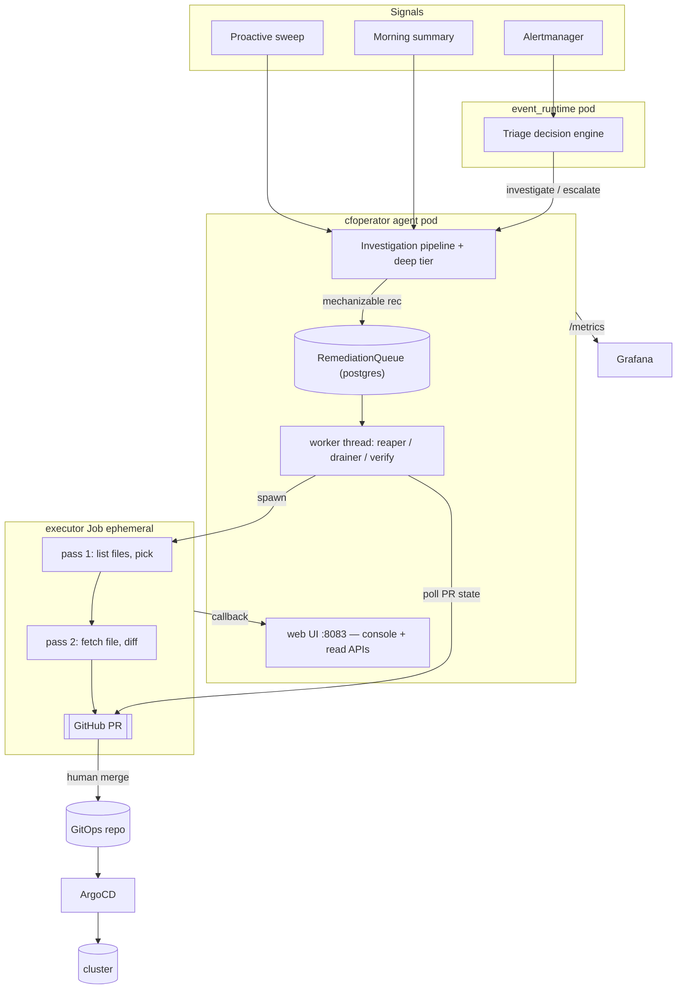
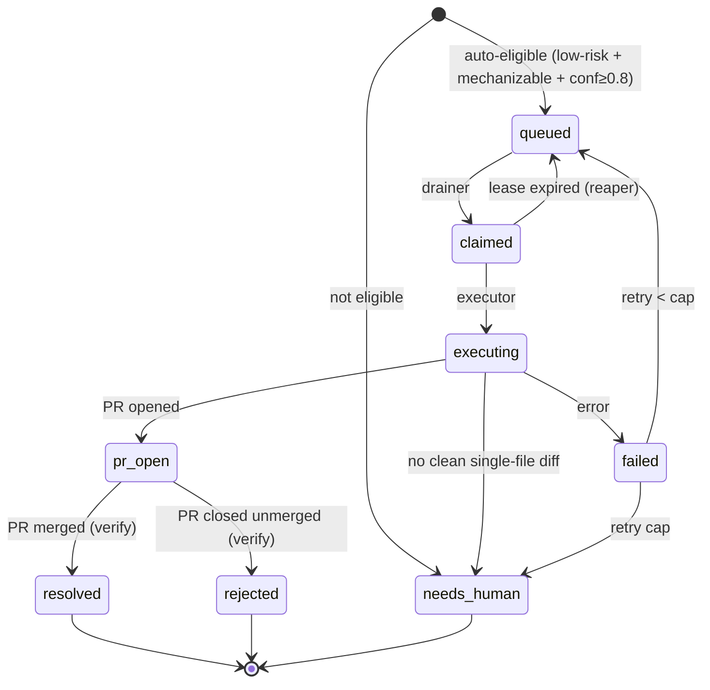

# Remediation & auto-heal

How CFOperator turns an observed problem into an autonomous (human-gated) fix.
Read-only toward the cluster end to end — the **only** mutation is a GitHub PR a
human merges, which ArgoCD then syncs.

## TL;DR

- Findings (alerts, proactive sweeps, the morning summary) are **triaged**.
- Anything the agent can look into itself becomes an **autonomous investigation**
  (logs/metrics/Loki/ssh) → a real outcome: `resolved` / `monitoring` /
  `escalated`, or a concrete recommendation.
- A *mechanizable* recommendation is enqueued on the **remediation queue**; the
  drainer hands it to a **file-aware executor Job** that opens a **PR**.
- You merge → ArgoCD syncs → the **verify** reconciler closes the loop to
  `resolved`. Genuinely human work (hardware, wiring, judgement) → `needs-human`.

Principle the design enforces: **don't punt to a human what the agent can
investigate or mechanize itself.** `needs-human` is the exception, not the dumping ground.

## Architecture



**Process topology:** `agent` and `event_runtime` are separate pods sharing one
postgres and one image; the **executor** and deep-investigation **worker** are
ephemeral Jobs (separate images). The drainer runs in the agent; the agent SA has
`batch/jobs` create; the executor SA is read-only.

## End-to-end flow

```mermaid
sequenceDiagram
  participant S as Signal (alert/sweep/summary)
  participant A as Agent
  participant Q as RemediationQueue
  participant X as Executor Job
  participant H as Human
  participant G as ArgoCD
  S->>A: finding
  A->>A: investigate (logs/metrics/ssh) → outcome
  alt mechanizable fix
    A->>Q: queue_remediation(class, risk, conf, repo)
    Q->>X: drainer claims (auto-gate) + spawns
    X->>X: pass1 pick file · pass2 diff vs real content
    X->>H: open PR
    H->>G: merge
    G-->>A: synced; verify reconciler → resolved
  else investigate-shaped
    A->>A: autonomous investigation → resolved/monitoring/escalated
  else genuinely human
    A->>Q: needs-human (tracked, not auto-acted)
  end
```

## The FIX contract

Everything above starts with one object. An investigation that ends
`needs_action` is asked to emit a **FIX** beside its prose recommendation — a
typed description of the change it is proposing. The FIX is what decides the
remediation's class, risk and confidence; the prose is what a human reads.

Before it existed the queue was fed by classifying free-form English, which is
why several parsers still sit upstream of it (see *Feeds*). The FIX replaces
guessing at a sentence with reading a field.

### Shape

```json
{
  "targets":  [{"kind": "gitops-manifest|k8s-object|k8s-imperative|host|database-row|external-system",
                "id": "path, name, or host",
                "repo": "a linked repo as owner/name, or omit"}],
  "observed": [{"source": "the command or file you READ",
                "value":  "what it actually said, verbatim"}],
  "steps":    ["ordered action"],
  "verify":   {"command": "check", "expect": "success signal"},
  "rejected": [{"alternative": "what you considered", "why_not": "why not"}],
  "risk":     "low|med|high"
}
```

It is read from the region after the **last** `STATUS:` in the reply — a
line-anchored `FIX:` first, then a fenced JSON block, and for a nudge reply
the bare object. (`FIX:` is line-anchored on purpose: a substring match also
hits `hotfix:` and `bugfix:`, then grabs the next `{` — usually findings JSON —
and drops the real FIX further down the same region.)

### What makes one invalid

Validation is **parse-or-None and never fills in a missing field**. A FIX is
refused if:

- `targets` is missing, empty, or any target lacks `kind` or `id`
- `steps` is missing, empty, or any step is not a non-empty string
- `verify` lacks either `command` or `expect`
- any `rejected` entry lacks either `alternative` or `why_not`
- `risk` is present but not one of `low` / `med` / `high`
- **`observed` is missing or empty**, or an entry is not an object, or lacks
  either `source` or `value` — every one of these is logged with its reason
  and the target ids
- a **`gitops-manifest` target names a `repo` that does not resolve** in the
  git registry

`observed` is required unconditionally rather than only for steps that change a
value. Deciding which steps those are means classifying free-form step text,
and that is the class of parser this contract exists to remove. A
restart-the-pod FIX records the pod's status and restart count, which is
evidence worth having.

The repo rule is a property of the kind, not a policy: the executor's first act
on a manifest patch is to list that repo's files, so an unresolvable repo can
only bounce. Resolution accepts either the registry short name or the
`owner/name` slug and always emits the slug, which is the form the executor
hands to GitHub. For every other kind an unresolvable repo is dropped rather
than fatal — a `host` target is actionable without one.

### What happens when it is invalid

Nothing is salvaged. On a `needs_action` outcome the agent asks **once** more,
with the schema; if that reply is also invalid the recommendation **degrades to
the CFOP-48 classifier** and still reaches the queue. An invalid FIX loses the
typed hints, not the finding.

### What a valid FIX decides

Class comes from the **first** target's kind:

| target kind | remediation class |
|---|---|
| `gitops-manifest` | `gitops-patch` |
| `k8s-object` | `k8s-action` |
| `k8s-imperative` | `k8s-imperative` |
| `host` | `node-action` |
| `database-row` | `data-fix` |
| `external-system` | `external-system` |

Confidence is deliberately stingy. **Only** a single-target `gitops-manifest`
at `risk: low` gets `0.8` — the one shape that can clear the auto gate.
Everything else gets `None` and parks, including every multi-target FIX. The
local primary reports 1.0 on calls it got wrong, so high confidence is not
inferred from the model's own certainty.

Two further bars sit in front of an auto-execute:

- A **fork-shaped** recommendation ("do X, or do Y") has its confidence cleared
  even when the FIX looks auto-eligible, because the FIX was parsed from the
  pre-rewrite text and may describe the alternative that was not chosen.
- The **mutation judge** gives a frontier model a veto on anything that would
  auto-execute. It is pinned to its own model floor, so a cost downgrade of the
  executor's model cannot demote the model holding the veto, and it **fails
  closed** — unavailable, unparseable, or raising all park the row.

`targets`, `observed`, `steps`, `verify` and `rejected` ride onto the queue row
and are rendered in the console drawer, so an operator sees the claimed current
state next to the proposed change.

### Limit worth knowing

`observed` is checked for **presence and shape, not truth**. Nothing yet reads
the target to confirm the claimed value, so a fabricated one passes. The
mechanism is that filling the field requires a tool call, and the read is what
puts the target's own context — a comment explaining a limit, say — in front of
the model. Verification against the live target is tracked separately.

## Remediation queue state machine



## Components

- **RemediationQueue** (`agent/knowledge_base.py`) — postgres table + ops
  (`queue_remediation`, `claim_next_remediation`, `update_remediation_status`,
  `fail_remediation`, `requeue_stale_remediations`, `reclassify_remediation`,
  `list/get/count`). Pure auto-gate: `remediation_is_auto_eligible`.
- **Feeds** → the queue / investigation pipeline:
  - deep-investigation results carrying `remediation_class` (`_maybe_queue_remediation`)
  - morning-summary recommendations (`_feed_remediations_from_summary`) — prose,
    not FIX objects; the summary path does not emit a FIX,
    with raw sweep-finding fallback; `investigate`-class recs are **dispatched as
    autonomous investigations**, not queued as needs-human. Mutation-shaped sweep
    recs go through the **CFOP-48 classifier + auto-queue gates** (CFOP-53) —
    only genuinely human-shaped recs enqueue directly as `manual`, and classifier
    degrade/failure falls back to that manual path rather than dropping a finding
  - manual operator-authored: `POST /api/remediations`
- **Worker thread** (`_remediation_worker_loop`) — reaper · drainer · verify, off
  the OODA loop so a long sweep can't starve them.
- **Executor Job** (`executor/`) — portable, stdlib-only, model-swappable
  (`CFOP_EXEC_LLM_BACKEND` = anthropic | openai-compat | claude-cli). **File-aware
  two-pass**: list repo manifests → LLM picks the file → fetch real content → LLM
  diffs against it → `open_pr_from_diff`. Per-item target repo (`payload.repo`).
  Read-only toward the cluster; slim image (~43 MB).
- **Callback** — executor → `POST /v1/remediations/<id>/complete` → drives the row.
- **Console + read APIs** — see [OBSERVABILITY.md](OBSERVABILITY.md).

## Flags

Resolve **DB setting (`kb.set_setting remediation_<flag>`) → config.yaml**, so
they toggle live (no redeploy) from the console pipeline bar.

| flag | effect |
|---|---|
| `queue_feed` | enqueue remediations from findings |
| `queue_drain` | claim queued items + spawn executors (opens PRs) |
| `queue_reap` | recover dead executor leases |
| `queue_verify` | advance `pr-open` rows by PR merge/close |

Auto-execute gate (enqueue → `queued` vs `needs-human`): class ∈
{`gitops-patch`,`k8s-action`} **and** `risk == low` **and** `confidence ≥ 0.8`.

A class is auto-eligible only if the executor can run it. `k8s-action` means
"expressible as a manifest edit" — the executor applies it by opening a PR.
`k8s-imperative` (a one-off kubectl verb: create a Job from a CronJob, delete
a pod, cordon a node) is deliberately **not** auto-eligible and has no runner:
it parks `needs-human`, and reaching the executor by human approval fails fast
naming the missing path rather than spending two LLM passes on a diff that
cannot exist. See CFOP-61.

## Imperative lane change records

`node-action` remediations run a gated command plan over SSH. Console approve
still escalates the queue row. For evidence-grade approval, deploy the
**changerecord** microservice (`changerecord/`) and point the agent at it with
`CFOP_EXEC_CHANGE_URL` (also under `remediation.executor.node_action.change_record.url`).

When the URL is **unset** (homelab default), behavior is unchanged: console
escalation → drain → executor SSH. No change-record HTTP at all.

When the URL is **set**:

1. Agent drain generates a concrete command plan (same allowlist the executor
   uses), then opens a record (`POST /open`) stamping that plan + executor
   image + flag snapshot. The plan is what a human merges.
2. Agent polls `GET /approval/{ref}` each tick; spawn is blocked until a named
   identity is returned. Unapproved records never reach `run_ssh_plan`.
3. Executor runs the **approved plan** (skips LLM planning), then `POST /close`
   with per-command results.

### Microservice swap model

One ClusterIP **Service** (`cfop-changerecord`); swap the **Deployment image** to
change backends — github today, snow/jira later. Agent and executor only speak
the 3-endpoint HTTP contract; there is no `github|snow|jira` switch in either.

| image | approval meaning |
|---|---|
| `cfoperator-changerecord` (github) | record PR under `change-records/`; merge = approve |
| snow / jira (later) | ticket state from `CFOP_EXEC_CHANGE_APPROVED_STATE` / `_CLOSED_STATE` on the recorder |

Approved/closed state names stay **env on the recorder Deployment**, not in the
agent or executor.

Auth: when `CFOP_CHANGERECORD_SHARED_SECRET` is set on the recorder, `/open`,
`/approval/{ref}`, and `/close` require `X-CFOP-Token` (same idiom as
`CFOP_COMPLETION_SHARED_SECRET`). `/healthz` stays open. Wire the secret into
the agent Deployment and the executor Job (via `cfoperator-secrets`).

**GitHub close note:** after merge, `close()` commits the outcome onto the
**base** branch (the merged record file). That commit fails under branch
protection on `main` — either allow the recorder bot to push to base, or treat
close as best-effort and rely on the PR conversation / agent result for
evidence until a follow-up lands a PR-based close path.

## Safety model

Single-file diffs only (multi-file → `needs-human`), exact-context apply (drift →
decline), secret-path refusal, branch dedupe, per-tick + retry caps, read-only
executor SA, and **human merge is the only mutation path** for GitOps classes.
Node-actions additionally require change-record approval when
`CFOP_EXEC_CHANGE_URL` is set.

## Deploy

CI (`build-cfoperator-main.yml`) builds `cfoperator`, `cfoperator-worker`,
`cfoperator-executor`, and `cfoperator-changerecord` (from `changerecord/`,
floating `:main` tag like the worker/executor). RBAC + config live in the private
`cfoperator-deploy` repo: `cfoperator-executor` read-only SA, the
`remediation:` config block, and `cfoperator-secrets` (`GITHUB_TOKEN`,
`ANTHROPIC_API_KEY`, `CFOP_COMPLETION_SHARED_SECRET`, and optionally
`CFOP_CHANGERECORD_SHARED_SECRET`). Wire `CFOP_EXEC_CHANGE_URL` and the
changerecord shared secret into the **agent** Deployment (not only Job env)
when using change records. After an executor code change, wait for the
`build-executor` job before re-queuing (else the Job pulls the prior `:main`).

## Operate

- Console: `:8083/remediations` (worklist + actions + flag toggles),
  `:8083/investigations` (outcomes + drill).
- APIs: `GET /api/remediations[/<id>]`, `GET /api/investigations[/<id>]`,
  `POST /api/remediations` (create), `.../<id>/{approve,resolve,reject,reclassify}`,
  `GET/POST /api/remediation/flags`, `POST /api/remediation/run-feed`.

## Known gaps

- Executor declines genuinely multi-file fixes (single-file gate) → `needs-human`.
- Orphaned `in_progress` investigations after a pod roll (in-memory queue) — a
  startup reaper for stale rows would mop these up (not yet built).
