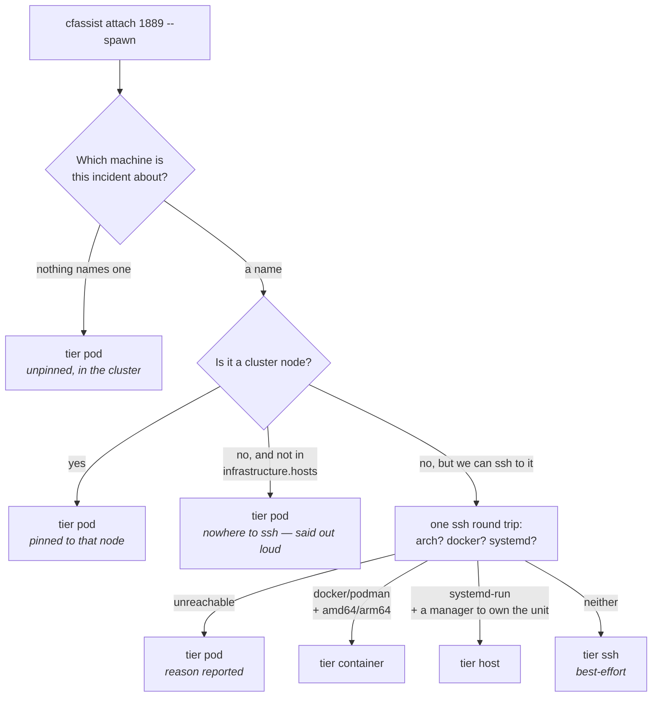

# The incident cockpit — from an alert to a briefed agent session

CFOperator's most valuable output is not the console page. It is the
**briefing**: what it observed, what it concluded, what it queued. This document
is about getting that briefing into the thing you actually work an incident
with — an agent in a terminal, with hands on the affected machine.

The workflow it replaces is the one the operator was already doing by hand:
read the Slack alert, open a terminal, start a coding agent, and type "check
investigation 1889" so it can go query the API itself. That works, and it beats
the console, which is why it is worth productizing rather than arguing with.

Six pieces, in the order you meet them.

## 1. The alert tells you the command

Every notification that carries an investigation — Slack, Discord, or an ntfy
push on your phone — now ends with the handoff line:

```
:warning: *CFOperator Event Runtime*
Action completed: investigate
Alert: Pod immich-kiosk-0 not ready
Action: investigate
Result: needs_action after 92.4s
Recommendation: Raise the memory limit to 512Mi
Investigated by: ollama/gemma4:26b
investigation_id: 1889
Take over: cfassist attach 1889
```

It is plain text on purpose. No backticks, no deep link: the same body goes to
three sinks and only plain text copies identically out of all of them. Deep
links and protocol handlers are client-side fiddliness for a later issue.

A notification without an investigation gets no line — there would be nothing to
attach to. Triage `notify` results, which exist specifically to keep Slack
volume down, stay one line as before.

## 2. `cfassist attach <investigation-id>`

`attach` is a verb of the released single-binary cfassist — the Go build in
`cfassist-go/`, which is what `gh release download` puts on your PATH. There is
nothing else to install: if you have `cfassist`, you have `attach`.

```bash
cfassist attach 1889
```

Pulls the investigation, its operator triage notes, any remediation queue rows
linked to it, and related knowledge-base learnings; renders them into a
briefing; seeds that briefing as session context; and drops you into the usual
cfassist TUI. The session starts already knowing what happened, so the first
thing you type is "what do we do", not "what happened".

The session says what it is attached to, both times you need it: the briefing
opens the scrollback, so you can read what the model was told, and the status
bar carries `#<id> · <trigger>` for the life of the session, shortening the
trigger and then dropping it on a narrow terminal so that the id — the thing
that ties the session to Slack and the console — is the last part to go.

Other shapes:

```bash
cfassist attach 1889 --print              # briefing only, no session
cfassist attach 1889 "did the pod recover?"   # one-shot with the briefing seeded
cfassist attach '#1889'                   # a pasted id
cfassist attach http://cfop:8083/investigations/1889   # a pasted URL
```

`--print` exists because the briefing is the product and cfassist is only the
first vehicle for it. Pipe it into whatever agent you actually use. It makes the
API calls and nothing else — no LLM connection is needed, so it works on a box
that has no model configured.

### Two things the briefing tells you about itself

**Learning provenance depends on the search mode.** The briefing marks knowledge
base learnings produced by *this* investigation with a `*`. That is only
possible in `fts` mode: the hybrid (vector + FTS) SQL path does not select
`investigation_id`, so in `hybrid` mode nothing can be attributed and the
briefing says so instead of implying the absence of a `*` means "not from this
investigation". This is not hypothetical — attaching to investigation #2204
returned three learnings from #2204 itself that could not be marked. The header
always names the mode it got.

**An empty report is stated, not hidden.** An investigation that stored no final
response is a known local-model failure mode, so the briefing prints
`(no report recorded …)` rather than an empty section — a broken investigation
should not look like a boring one.

If the remediation queue or the knowledge base is unreachable, `attach` still
briefs you and lists what it could not fetch under **Incomplete briefing**.
Degrading visibly beats failing totally when you are mid-incident.

### Setup

`attach` talks to the console API from wherever you are, using the same
database-backed bearer token everything else does. There is no separate
credential.

0. Install the binary, if you have not:

   ```bash
   gh release download cfassist-v0.7.1 -R aachtenberg/cfoperator \
     --pattern 'cfassist-linux-arm64'
   chmod +x cfassist-linux-arm64
   sudo mv cfassist-linux-arm64 /usr/local/bin/cfassist
   ```

   (Pick your platform: `linux-amd64`, `linux-arm64`, `linux-arm`,
   `darwin-amd64`, `darwin-arm64`. Or build from source: `cd cfassist-go &&
   make build`.)

1. Mint a token at `<console>/admin?tab=tokens`. **`read` scope is enough** —
   attach never writes (see below).
2. Point cfassist at the agent, either by environment:

   ```bash
   export CFOP_AGENT_URL=http://127.0.0.1:8083
   export CFOP_API_TOKEN=cfop_…
   ```

   …or per-invocation with `--agent-url`:

   ```bash
   cfassist attach --agent-url http://127.0.0.1:8083 1889
   ```

   > **Not `--url`.** The global `--url` flag is the *LLM* endpoint. Pointing it
   > at the agent — natural enough against a port-forward — sends prompts to
   > CFOperator as if it were a model server, and fails confusingly rather than
   > loudly. Precedence is `--agent-url` → config file → `CFOP_AGENT_URL`.

   …or in `~/.cfassist/config.yaml`:

   ```yaml
   cfoperator:
     url: http://192.168.1.50:8083   # the agent host, not this machine
     token: ${CFOP_API_TOKEN}
     timeout: 30
   ```

   Config values win; the environment fills in whatever the file leaves blank.
   These are the same variable names `mcp_server` reads, so a workstation
   already set up for MCP needs nothing new.

   > **The URL is the agent's host, as reachable from where you are.** A
   > loopback address is right only when cfassist runs *on* the agent host, or
   > through the port-forward below — which is the opposite of attach's point.
   > The default config file cfassist writes on first run shows the LAN form for
   > that reason. It writes that file before it calls the agent, so a first run
   > against the wrong address still leaves you something to edit.

3. If the agent is in-cluster, `:8083` is firewalled to cluster sources (see
   [mcp-server.md](mcp-server.md)); from a workstation use
   `kubectl -n apps port-forward svc/cfoperator 8083:8083`.

### attach is read-only, and structurally so

The client refuses any HTTP method that is not GET, in the transport itself
(`cfassist-go/internal/cfoperator/client.go`, `allowedMethods`) rather than by
convention. Approving, rejecting, resolving or reclassifying a remediation is a
deliberate human action in the console — an attached session must not be able to
reach for it even by accident. The briefing tells the model this too, so it
recommends those actions rather than claiming to have taken them.

A contributor who adds a mutating helper fails a test before they can ship it,
from both sides: the Go transport test asserts a non-GET never reaches the
socket, and `test_cockpit_attach_contract.py` asserts the allowlist itself has
not grown.

### Session tokens: minted at attach, dead at detach (CFOP-32)

An interactive `attach` mints a short-lived token for the session (label
`cockpit-inv-<id>`, default scope `investigate`, default TTL 4h —
`--session-ttl` to change, `--no-session-token` to opt out). The binding to
the investigation is **recorded at mint** — audit detail plus the label — not
enforced at verify; tightening that is future work. For the session's
lifetime, `CFOP_API_TOKEN` — the variable every client and child process
actually reads — is overwritten with the minted secret, so children inherit
the dying credential instead of the operator's standing one. On clean exit
the token is revoked and the environment restored; TTL covers unclean exits —
a leaked cockpit token from yesterday is useless today. Mint and revoke land
in the audit log with the investigation id.

`--remediate` *requests* the remediate scope; the server's role→scope ceiling
decides (a member can never mint above their own ceiling). `--print` and
one-shot questions mint nothing — there is no session for a token to die with.
Minting is best-effort against older agents: a failed mint warns and the
briefing proceeds on your standing token.

The mint/revoke calls deliberately do not go through the read-only client:
they use their own transport (`sessiontoken.go`) whose allowlist is exactly
`POST /api/auth/tokens` and `DELETE /api/auth/tokens/<id>`, so the GET-only
guard above stays intact and this client can't be bent toward approve/reject
either.

## 3. Any MCP client as the cockpit

cfassist is the first-class vehicle, not the only one. CFOperator briefs *any*
agent, and MCP is the neutral contract: the live MCP server exposes the same
investigations, remediations and knowledge base as tools, resources and skill
prompts.

Copy [`examples/cfoperator.mcp.json`](examples/cfoperator.mcp.json) to `.mcp.json`
in your working directory (or merge the `cfoperator` entry into your host's
config), keep the stdio *or* the HTTP entry, and delete the other. Then:

```
> read cfop://investigations/1889 and tell me what the agent already checked
```

For Claude Code specifically, the equivalent one-liners:

```bash
# stdio, against a port-forwarded agent
claude mcp add cfoperator -e CFOP_AGENT_URL=http://127.0.0.1:8083 -- python -m mcp_server

# HTTP, against the deployed MCP server
claude mcp add --transport http cfoperator http://10.0.0.14:8090/mcp \
  --header "Authorization: Bearer $(kubectl -n apps get secret cfoperator-mcp -o jsonpath='{.data.token}' | base64 -d)"
```

Tools, resources, prompts, the scope ladder and the per-token scope semantics
are all documented in [mcp-server.md](mcp-server.md) — this page does not
restate them.

**Keep `remediate` out of a shared host config.** `read` works an incident;
`investigate` adds triage and `ask_sre`; `remediate` hands an agent the approve
button. If you need a remediate-capable consumer, give it its own deployment,
its own token and its own scope rather than widening the shared one.

## 4. `--spawn`: the session on the affected infrastructure (CFOP-35)

Everything above briefs a session *wherever you already are*. `--spawn` puts it
where the incident is:

```bash
cfassist attach 1889 --spawn
```

One flag on the command the alert already told you to run. It asks the agent to
launch an ephemeral Job, waits for the pod, and attaches your terminal to the
briefed session running inside it:

```
cockpit spawned: apps/cfop-cockpit-1889-142233 (pinned to node raspberrypi4)
session token cfop_9f2a… — pod and token expire in 4h0m0s
attaching (kubectl attach -it -n apps job/cfop-cockpit-1889-142233) — detach with ctrl-p ctrl-q; exit ends the cockpit
```

Use it and destroy it, keep the memory: the compute is disposable, the state
stays central.

**Where it lands.** If the investigation is host-level, the pod is pinned to
that node with a `nodeSelector` — kubectl, ssh and the node's own view are then
local. The interesting case is the one that made the issue worth writing: the
affected node is frequently the *cordoned* one. A cockpit tolerates nothing, so
any `NoSchedule`/`NoExecute` taint (cordon, NotReady, pressure) means it spawns
adjacent and says so, rather than sitting `Pending` while you wait.

**What it can do.** Nothing you could not do by reading. The pod runs as
`cfoperator-cockpit`: read-only cluster-wide, no exec, no write verbs, no
secrets — the same posture as the deep-investigation worker. Remediation still
goes through the PR and the console gate, from inside a cockpit exactly as from
outside one.

**What it costs.** `activeDeadlineSeconds` is the session TTL (4h by default,
`--session-ttl` to change, 12h ceiling), `ttlSecondsAfterFinished` is an hour,
and `backoffLimit` is 0. Close the laptop, lose the VPN, forget it entirely: the
Job dies on its deadline and takes its credential with it. Two cockpits may run
at once; a second `--spawn` for the same investigation lands you back in the
one you already have rather than starting another.

**The credential.** The agent mints the per-investigation session token
(CFOP-32's mint path, `investigate` scope, the pod's TTL) and delivers it as a
short-lived Secret the Job references. It is never an `env` value in the
manifest — anything that can read Jobs could read it there, including the
cockpit's own service account — and it is never in the HTTP response either, so
it stays out of your shell history. The Secret is owned by the Job, so
Kubernetes' garbage collection removes it with the Job.

**Who may spawn.** Admin only: this creates a workload and mints a credential.
Members keep plain `attach`.

**The terminal is yours.** The agent hands back coordinates — as argv, never as
a command string to hand a shell — and the attach runs on your machine with
your credentials: `kubectl attach -it` in the cluster, `ssh -t` outside it. No
service account in this system holds `pods/exec` or `pods/attach`, and the
ladder deliberately does not add one — an operator spawning a cockpit from a
laptop already has that access. The agent-side PTY bridge is only needed by the
console drawer (CFOP-59), and that is where that RBAC decision belongs.

### Enabling it

Spawning is a cluster write, so it is off until the RBAC exists:

```bash
helm upgrade … --set cockpit.enabled=true
```

which creates the read-only `cfoperator-cockpit` service account the pod runs
as, and grants the agent Jobs plus `create` (only) on Secrets in the release
namespace. Without it the endpoint answers, kubectl refuses, and you get a
`kubectl create failed: jobs is forbidden` — a loud failure, not a silent one.

The image is `ghcr.io/aachtenberg/cfoperator-cockpit:main` (amd64 + arm64,
because the affected node is frequently a Pi). It derives from the worker image
— kubectl, ssh, claude-code, non-root uid 10001 — and adds cfassist.

## 5. Cockpits on hosts outside the cluster (CFOP-36)

Everything above puts the session in the cluster. Most of this fleet is not in
the cluster — bare Pis, the GPU box, VMs — and those are the machines where you
most want a shell, because the journal, the disks and `ip neigh` are only there.

So `--spawn` follows the fleet. **Same command, nothing new to learn:**

```bash
cfassist attach 1889 --spawn
```

CFOperator works out which machine the incident is about, asks that machine what
it can run, and puts the session there. If it is a cluster node you get the pod
from §4. If it is a Pi with docker you get a container. If it is a Pi with
nothing you get a process. You type the same thing either way.

### The ladder at a glance

| If the host has… | you get tier | isolation | what cleans it up |
|---|---|---|---|
| membership in the cluster | `pod` | a pod, read-only service account | Kubernetes (`activeDeadlineSeconds` + GC) |
| docker or podman, on amd64/arm64 | `container` | a container | a `timeout` wrapper, then the janitor |
| `systemd-run` and a systemd manager | `host` | **none** | a transient timer, then the janitor |
| none of the above | `ssh` | **none** | the janitor only |

Reading down that table, only two things change: how well the session is walled
off from the host, and what removes it afterwards. Everything else is identical
— same briefing, same model, same commands, same TTL, same dying credential.



### Setting it up

Two things, on top of the `cockpit.enabled` from §4. Tier 1 needs neither — if
you only ever spawn into the cluster you can skip this whole section.

**1. Put the host in the inventory.** The host tiers reach machines by ssh, so
CFOperator has to know the address and the login. This is the same
`infrastructure.hosts` block the SSH tools and the host sweep already use — if
you have those working, you are already done. See
[infrastructure-config.md](infrastructure-config.md).

```yaml
infrastructure:
  hosts:
    raspberrypi5:
      address: 10.0.0.15
      ssh:
        user: sre
        key_path: /root/.ssh/id_rsa
```

The **key of the block** (`raspberrypi5`) is the name CFOperator matches against
alerts and findings, so make it the name your alerts actually use.

**2. Give the agent a key.** Tier 1 only ever talks to Kubernetes; tiers 2/3
log in to machines, and the agent pod has no key by default. On Helm:

```bash
helm upgrade cfoperator charts/cfoperator \
  --set cockpit.enabled=true \
  --set cockpit.ssh.secretName=cfop-forensics-ssh \
  --set cockpit.ssh.user=sre
```

`cfop-forensics-ssh` is the keypair the deep-investigation worker and the
node-action executor already use, so on an existing install this secret exists
already. Deploying by hand instead? [DEPLOYMENT.md](DEPLOYMENT.md) has the
manifest change (mount the secret at `/cockpit-ssh`, set
`CFOP_COCKPIT_SSH_SECRET_DIR` and `CFOP_COCKPIT_SSH_USER`).

**3. Tell the session how to call home.** This one is easy to miss and the
spawn refuses without it, on purpose.

```yaml
cockpit:
  host_agent_url: http://10.0.0.14:8083   # the agent, as the FLEET sees it
```

`cockpit.agent_url` — the one that already exists — is *what the pod calls*,
and it defaults to cluster DNS. A Pi cannot resolve
`cfoperator.apps.svc.cluster.local`, so a host-tier session set up with it
would attach fine and then fail to fetch its own briefing: a briefed session
with no briefing, discovered from inside. One knob cannot serve both runtimes,
so tiers 2/3 get their own, and a spawn that would use a cluster-only name is
refused up front with this key named.

The same applies to `llm.primary.url`, for the same reason and without the
guard: it has to be an address the fleet can reach, not `127.0.0.1`.

**4. Check it took.** Name the host and the rung explicitly, so the test is of
the ssh key and nothing else:

```bash
cfassist attach 1889 --spawn --host raspberrypi5 --tier ssh
```

`--tier ssh` is the useful smoke test: it is the rung every reachable host has,
so it works even on a machine with no docker and no systemd. Read the first two
lines of output — they say which machine and which tier, which is the whole
question. If you get `could not be probed (Permission denied (publickey))`,
step 2 has not landed; if you get `is not in infrastructure.hosts`, step 1 has
not; and if you get `only resolves inside the cluster`, step 3 has not.

Fixed one of them? Just run it again. A failed probe is cached for seconds, not
minutes, precisely so that mounting the key and retrying works the way you
would expect it to.

### Using it: a bare Pi, start to finish

An alert fires about `raspberrypi5`, CFOperator investigates and cannot fix it,
and Slack gives you the line it always gives you. You add one flag:

```console
$ cfassist attach 1889 --spawn
cockpit spawned: raspberrypi5:cfop-cockpit-1889 (process on raspberrypi5 — user transient timer expires it in 14400s)
  target: from the remediation queued off this investigation
session token cfop_9f2a… — session and token expire in 4h0m0s
  no isolation at this tier: the session runs directly on the host, and the short-lived token is the security model
attaching (ssh -t sre@10.0.0.15 /tmp/cfop-cockpit-1889/run) — exit ends the cockpit; the TTL ends it either way

cockpit — investigation #1889 — no isolation: this session runs directly on the host
the session token dies with this session, or at its TTL.

[briefing loads: what CFOperator observed, concluded, and queued]

> the NIC is down again isn't it — check dmesg and ip neigh
```

You are now on the Pi, in a session that already knows what happened, with the
model reading the same investigation you are. Ordinary shell commands work; so
does asking the model to run them.

When you are finished, `exit`. The session ends, and the credential and the
binary it used are deleted on the way out. If you close the laptop instead, the
TTL does it four hours later; if something goes wrong with the TTL, the janitor
does it within fifteen minutes. **You do not have to clean up after yourself.**

And you can run the same command again straight away. A second `--spawn` for an
investigation whose session is still alive puts you back in *that* session
rather than starting a second one; if the previous one has ended, the leftovers
are cleared before the new one starts — a stopped container still holds its
name, and a still-armed self-destruct timer would otherwise fire on the new
session.

The same thing on a docker host reads almost identically — the difference is one
word in the first line (`docker container on ubuntu-llm-01`), no isolation
warning, and `ctrl-p ctrl-q` detaches without ending the session.

### Reading the output

Five lines, and each answers a question you would otherwise have to go looking
for mid-incident:

```
cockpit spawned: raspberrypi5:cfop-cockpit-1889 (process on raspberrypi5 — …)
                 └── where it went, and what it is called
  target: from the remediation queued off this investigation
          └── HOW that machine was chosen — the one to check when it looks wrong
session token cfop_9f2a… — session and token expire in 4h0m0s
              └── when this stops working, whatever you do
  no isolation at this tier: …
  └── only printed at tiers `host` and `ssh`; the absence of this line is meaningful
attaching (ssh -t sre@10.0.0.15 …) — exit ends the cockpit; …
          └── the exact command running on YOUR machine, and how to leave
```

The `target:` line is the one worth reading twice. Landing on the wrong box is
otherwise only discoverable once you are inside it, wondering why the disk looks
fine.

### Overriding the choice

Two flags, both `--spawn` only. Passing either without `--spawn` is refused
rather than ignored — a plain `attach` already runs on your machine, so there
would be nothing for them to act on.

**`--host <name>` picks the machine.** Resolution is a heuristic over the
remediation rows and the trigger text, and you can see things it cannot:

```bash
cfassist attach 1889 --spawn --host raspberrypi5
```

The name is the key from `infrastructure.hosts`, or a cluster node name. The
output then reads `target: requested by the caller`, so it is obvious later
that the machine was your choice and not CFOperator's.

**`--tier pod|container|host|ssh` picks the runtime:**

```bash
cfassist attach 1889 --spawn --tier container
```

If that tier is not available you get an error naming what is missing and what
is available instead — **never a quiet downgrade to something weaker.** If you
asked for a container because you wanted the container boundary, silently
handing you a bare process on the host would be the worst possible answer.

`--tier pod` is worth knowing: it forces a cluster pod for a finding about a
bare host, which is what you want when the host itself is the thing that is
broken and you would rather look at it from next door.

### Checking on sessions, and cleaning up by hand

You should not need to, but mid-incident "what did I leave running" is a fair
question.

```bash
# containers, on any docker host
ssh sre@10.0.0.20 'docker ps --filter label=cfop.dev/role=cockpit'

# process sessions, on any host
ssh sre@10.0.0.15 'ls -d /tmp/cfop-cockpit-* 2>/dev/null'

# pods, in the cluster
kubectl get jobs -n apps -l cfop.dev/role=cockpit

# remove one by hand (the janitor would get it within a cycle anyway)
ssh sre@10.0.0.15 'rm -rf /tmp/cfop-cockpit-1889'
ssh sre@10.0.0.20 'docker rm -f cfop-cockpit-1889'
```

Every artifact is named `cfop-cockpit-<investigation-id>`, on every tier and in
every runtime, so one name finds the pod, the container and the directory.

Two cockpits may run at once *per runtime*: two in the cluster, and two on each
host. The host half is not tidiness — every session mints a token onto a
machine that has no cluster-side ceiling above it, so something has to bound
how many there can be. Your own session never counts against you: re-running
your command returns the cockpit you already have.

The janitor runs on the agent every fifteen minutes and removes anything whose
recorded expiry has passed. Change the interval in the console settings
(`cockpit_reap_interval`, in seconds) or with
`cockpit.janitor_interval_seconds` in config; the console setting wins, so you
can change it without a redeploy.

### When it does not work

| What you see | What it means | What to do |
|---|---|---|
| `tier pod — the affected host is neither a cluster node nor a configured ssh host` | the name CFOperator resolved is not one it knows how to reach, so it put you in the cluster instead | add it to `infrastructure.hosts`, using the name your alerts use |
| `tier 'ssh' … (the host is not in infrastructure.hosts, so it was never probed)` | the same thing, but you forced a host tier, so it refused rather than quietly giving you a pod | same fix — or drop `--tier` and take the pod |
| `the affected host could not be probed (Permission denied (publickey))` — and you get a pod | the agent has no usable key for that host | setup step 2; check the secret is mounted and `cockpit.ssh.user` matches the host's login |
| `the affected host could not be probed (No route to host)` — and you get a pod | the host is down or unreachable *from the agent* | this is a finding, not a bug: a session on an unreachable box is impossible, and the pod you got can still investigate it |
| `tier 'container' was requested but is not available … (neither docker nor podman is installed); available: pod, host, ssh` | you forced a rung the host does not have | drop `--tier`, or pick one of the listed ones |
| `kubectl create failed: jobs is forbidden` | tier 1's RBAC is not applied | see the CFOP-35 section in [DEPLOYMENT.md](DEPLOYMENT.md) |
| `could not fetch cfassist-linux-arm64 from cfassist-v0.9.0 …; is the release tagged?` | the pinned cfassist version has no published release | tag it, or pin an older one with `CFOP_COCKPIT_CFASSIST_VERSION` |
| `only resolves inside the cluster … set cockpit.host_agent_url` | the session would have been told to call the pod's address | setup step 3 |
| `cockpit concurrency cap reached` | two cockpits are already running — in the cluster, or on that host | exit one (the message names them), or attach without `--spawn` |
| `spawning a cockpit is admin-only` | you are a member | ask an admin, or use plain `attach` — the briefing is the same |
| the session starts but the model never answers | the session cannot reach the LLM | check `llm.primary.url` is an address reachable *from the fleet*, not `127.0.0.1` |
| the session starts but the briefing is empty or errors | the session cannot reach the agent | same shape as the row above, for `cockpit.host_agent_url` |
| you fixed the cause and the same error came back | not the probe cache — failures are only held for seconds | look again: the message names what it actually tried |
| it landed on the wrong machine | the host was resolved from something misleading | read the `target:` line, then re-run with `--host <name>` |
| `--tier only applies to --spawn` | you passed `--tier` or `--host` without `--spawn` | add `--spawn`, or drop the flag — a plain attach runs here, not there |

Notice the pattern in the first three rows: **not knowing how to reach a host
is not an error.** An unreachable host and a host with no inventory entry both
fall back to a pod in the cluster and say so on the first line, because a
cockpit next to the problem beats no cockpit at all. They only become errors
when you forced a host tier with `--tier` — at which point refusing is the
right answer, since you asked for something specific.

---

The rest of this section is *why* it works this way. Skip it unless something
surprised you.

### How the machine gets chosen

Not from the investigation's `host_id`. That field reads like the answer and is
not one: it is the area-of-responsibility column for multi-agent installs, and a
normal install sets it to `cfoperator` on every row. Reading it is what made
tier 1's `nodeSelector` a no-op for its whole life — every spawn asked the
cluster for a node called `cfoperator`, got nothing, and reported "spawned
anywhere". The order that actually works is:

1. `--host` on the command, if you gave one;
2. the `host_id` of a remediation queued off this investigation — that one *is*
   derived from the finding;
3. a configured host named in the trigger or the findings, matched on whole
   names so `raspberrypi4` never matches `raspberrypi45`;
4. none, in which case tier 1 spawns unpinned, as it always did.

Guessing beyond the configured inventory has no upside: an unconfigured name has
no address and no credential, so the spawn would fail one step later anyway —
and a wrong guess puts you on the wrong machine mid-incident.

### How the runtime gets chosen

One ssh round trip asks the host what it has — architecture, `docker`, `podman`,
`systemd-run`, whether there is a systemd manager to own a transient unit — and
the answer is cached for fifteen minutes. **Detection, not configuration:**
nothing is declared per host, and a host that loses docker drops a rung by
itself rather than erroring.

It asks with `command -v` rather than `docker info`, because `info` connects to
the daemon and blocks for seconds on a host where docker is installed but
stopped — and this probe runs while you are waiting for a shell.

`systemd-run` being installed is not enough on its own. As a non-root ssh user
it needs either a running user systemd manager or passwordless sudo that the
deployment has explicitly allowed (`cockpit.allow_sudo`, default off). Without
one of those the self-destruct timer cannot be created, and a tier whose cleanup
silently does not exist is worse than the honest `ssh` rung that admits it.

### What each tier gives up

At tier 2 the token reaches the container through the ssh connection's stdin,
never through the command line, so it stays out of the host's process table. It
is still visible to `docker inspect` — that is the honest step down from tier 1,
where the credential lives in a Kubernetes Secret the manifest only references,
and it is bounded by the TTL either way.

At tiers 3 and 3b **there is no isolation left, and the short-lived token is the
security model.** The session runs as your ssh user, directly on the host.
`--spawn` says so on the way in, every time. In exchange you get what a pod on a
different machine cannot give you: that host's journal, its disks, its ARP
table, its `dmesg`.

Tier 3 also differs in *when* the session starts. At tiers 1 and 2 something is
already running and your attach joins it; at tier 3 there is nothing to run it
in, so the session starts when your ssh executes the delivered runner. What that
costs is survival across a dropped connection — reattaching needs a multiplexer
on the host, which is CFOP-59's problem. What it does *not* cost is the expiry:
the credential and the binary are removed at the deadline whether anyone
attached or not.

### Why the janitor keeps no list

Kubernetes reaps tier 1 for free. Nothing reaps a container or a `/tmp`
directory on a Pi, and the sessions that leak are by definition the ones nobody
is watching — the laptop that closed, the VPN that dropped.

So the janitor does not track what it spawned. It enumerates `cfop-cockpit-*` by
name and reads the expiry each artifact carries, which is deliberately stronger:
an agent that restarted, or a previous agent instance, leaves sessions no list of
ours would remember, and those are exactly the orphans the bottom rung produces.
Kill `-9` your ssh mid-cockpit and the host is clean within a cycle.

The expiry is an integer written at spawn — a container label, a file in the
session directory — rather than a creation date read back later, because
`docker ps` renders dates differently across versions and locales, and a janitor
that misreads one either spares an orphan or kills a live session.

## 6. What the session leaves behind (CFOP-37)

The cockpit's whole claim is *use it and destroy it, keep the memory*. Sections
1–5 are the "destroy it" half. This is the memory.

Without it, a cockpit is a terminal that happens to start briefed: the pod
dies, the container is reaped, the `/tmp` directory is removed, and everything
you worked out goes with them. CFOperator's knowledge base keeps only what the
autonomous agent found — never what you found.

### What happens when you exit

Nothing to remember and nothing to type. On the way out, the session asks the
model it has been talking to for a summary of itself, and posts the result back
before its credential is revoked:

```console
> exit
learning #142 stored: Stale CIFS handle after a NAS reboot
session recorded on investigation #1889: resolved (14 exchanges, 10m40s)
```

Two writes, and the second is the one that always happens:

- **The session record** — outcome, a few sentences of what was checked and
  found, the commands that mattered, and where you were (tier, host, duration).
  It appends *beside* the investigation; it never edits what the agent
  concluded, because that is the corpus later triage decisions reason from.
- **A learning**, only if the session concluded something reusable. Most
  sessions do not — you looked, it was a false alarm, you left — and a
  knowledge base that gains an entry per session degrades faster than one that
  gains none. When there is one, it is what makes the *next* incident cheaper.

### Where it shows up

Three places, and each is a different reader:

| Where | Shows | Why there |
|---|---|---|
| `/investigations` drawer | every session on that investigation, above the agent's recommendation | someone triaging wants "has a person already been here" first |
| the next `cfassist attach <same id>` | the same sessions, in the briefing | the next session opens knowing what the last one tried |
| a *different* investigation of the same alert class | the **learning**, via the KB search every briefing and triage does | this is the compounding: a fix found once is cited the next time the class fires |

That third row is the one worth watching for. It is the difference between a
knowledge base of what the agent learned and one of what the team learned.

### Why a learning needs `applies_when`

A learning is stored with a **trigger condition** — the observable symptom that
should bring someone back to it. Not a restatement of the title: a symptom
someone would actually notice.

This is not a style rule. Retrieval matches on it, so a learning without one can
never be found — and the knowledge base auto-deprecates it on arrival rather
than letting it dilute search. The session's summarizer is told this, and
cfassist drops a half-filled learning before sending it, so you get a warning
instead of a silent no-op:

```
warning: the session's learning was not stored: refusing to store a learning
  with no trigger condition — it would be auto-deprecated and never retrieved
```

### When the model cannot summarize

Local models have bad days. The session is still recorded — the raw tail of the
transcript, explicitly marked:

```
warning: could not summarize the session (…) — recording the raw tail instead
session recorded on investigation #1889: inconclusive (9 exchanges, 4m02s)
```

The console and the briefing both label it `raw tail`, so nobody reads a
transcript fragment as a conclusion the session reached. Losing the only record
of a session would be worse; presenting a fragment as a summary would be worse
still.

### Turning it off

```bash
cfassist attach 1889 --no-writeback
```

Opt-*out*, deliberately: a default-off memory feature is one nobody remembers to
turn on. It says what it discarded, in the units you just spent:

```
session not recorded (--no-writeback): 14 exchanges on investigation #1889 discarded
```

A session with no exchanges — attached, read the briefing, left — records
nothing either way. There is nothing to distil, and a row saying "a human looked
and said nothing" is noise in a place that has to stay worth reading.

### Which sessions carry it

Write-back is a cfassist feature, and each tier gets its cfassist differently —
so they gain it at different moments:

| Session | Gets cfassist from | Has write-back |
|---|---|---|
| tier `pod`, tier `container` | the cockpit image, built from the tree | as soon as the image rolls |
| tier `host`, tier `ssh` | the pinned `cfassist-v<version>` release | once that release carries it |
| a plain `attach` on your machine | whatever binary is on your PATH | once you upgrade it |

This is the same property `cockpit.cfassist_version` already documents, seen
from the other side: a host tier runs a *released* binary on purpose, so that
a session is reproducible and not whatever happened to be on main. The cost is
that a new cfassist feature reaches those two tiers a release later than the
other two. A session on an old binary simply does not write back — there is no
error, because nothing tried.

### Who is allowed to write it

The session itself, using the short-lived token minted for it (§2). Both writes
take the `investigate` scope that token already carries, so **the credential
that dies with the session is the one that records what the session learned** —
no standing credential, no admin role, nothing left behind that could write
again tomorrow.

That is also why the write happens *before* the token is revoked on exit, which
is the one piece of ordering in `attach` that is explicit rather than deferred.

### When it does not work

| What you see | What it means | What to do |
|---|---|---|
| `the session was NOT recorded on investigation #N` | the write failed — agent unreachable, or the token expired mid-session | the transcript is still on your screen; the console's triage note is the manual path |
| `the session's learning was not stored` | the model produced a learning with no trigger condition | nothing to do: the session record still landed, and a learning nothing could retrieve was worth less than the warning |
| `could not summarize the session` | the model failed or answered with prose | nothing to do: the raw tail was recorded and is marked as such |
| `write-back needs the investigate scope` | the session ran on a `read`-scoped token | mint with `investigate` (the default for `attach`); `--no-session-token` sessions write with whatever standing token you have |
| nothing printed at all on exit | there were no exchanges, or `--no-writeback` | expected — see above |

### What write-back deliberately is not

- **Not the transcript.** What leaves the machine is a summary and a few
  commands, not your scrollback. A tier-3 session's output is whatever you
  typed on a production host, and it has no business being shipped by default.
- **Not a changerecord entry.** The issue asked for one; that service's contract
  is an approval workflow for a *proposed* change (a remediation id, a command
  list, an executor image) and a session is none of those — it already happened
  and needed no approval. The same facts land in the audit log, beside the
  `token.created` and `token.revoked` rows for the same session.
- **Not automatic triage.** Recording that you resolved something does not set
  the investigation's `triage_action`. That is still a deliberate click in the
  console, because it is a claim about the incident rather than about your
  session.

## What the cockpit deliberately is not, yet

- **No agent-side terminal.** The attach needs kubectl or ssh on your machine.
  A browser cockpit needs a PTY bridge in the agent — CFOP-59.
- **No remediate profile.** There is one cockpit identity and it is read-only.
  A write-capable cockpit waits until something actually needs one.
- **No reattach after a drop.** Tiers 1 and 2 survive one (the pod and the
  container keep running); tier 3 does not. `tmux` is probed for and recorded
  against the day CFOP-59 needs it.
- **No deep links.** Copy-paste is the interface.
