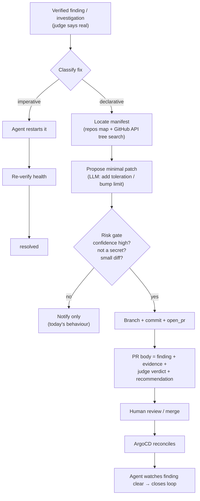

# Remediation Pipeline (design)

**Status:** draft / in progress. Phase B (the first end-to-end slice) is being
built behind a default-off flag.

## Motivation

Today CFOperator *diagnoses* and *recommends* but never *acts on* an alert
beyond restarting things ad hoc. After the `STATUS` + `RECOMMENDATION` work, a
completed investigation carries an accurate verdict and a concrete next step —
but a human still has to read it and apply the fix. The goal of this pipeline is
to close that loop: when a finding is **verified real** and the fix is
**low-risk and well-understood**, CFOperator should either fix it directly or
**open a PR** that fixes it.

### Why a PR (not `kubectl edit`)

The homelab cluster is **pure ArgoCD GitOps** — git is the source of truth. A
direct imperative change to a resource's *spec* is drift and ArgoCD reverts it
within minutes. So declarative fixes (manifest changes) **must** flow through
git: branch → commit → PR → human merge → ArgoCD reconcile. The PR is not a
nicety; it is the only correct mechanism, and the human merge is the safety
valve.

## Two classes of fix

| Class | Example | Mechanism | Drift-safe? |
|---|---|---|---|
| **Imperative ("kick it")** | restart a crashlooping pod | agent runs `rollout_restart` / `restart_service` directly | Yes — does not change spec |
| **Declarative (spec)** | pod unschedulable (missing toleration); bump a resource limit | **PR to the manifest repo** | Only via git |

Imperative fixes may auto-apply once trusted. Declarative fixes are **always**
PR-gated (human merge) for the foreseeable future.

## Pipeline

The **judge** is what makes acting safe: only verified, high-confidence findings
ever reach the patch/PR stage. Everything else degrades to the
notify-with-recommendation behaviour that exists today.

## What already exists (building blocks)

- `event_runtime/github_actions.py` — `OpenPRActionHandler` (`open_pr`),
  `CommentIssueActionHandler`, `InvestigateCodeActionHandler`.
- `event_runtime/github_client.py` — `GitHubApiClient` (auth, retries, paging).
- `config.yaml` `repos:` — repo inventory (github slug + local path) per app.
- `agent/agent.py` `_verify_findings` / `_verify_single_finding` — the
  adversarial "try to disprove it" judge (currently sweep-only).
- Imperative remediation tools: `rollout_restart`, `restart_service`,
  `docker_restart`.

## Gaps (what this work adds)

1. **Decision vocabulary** — `_TRIAGE_VALID_ACTIONS` is frozen to
   `{log_only, notify, investigate, escalate}`; `open_pr` is a registered
   handler nothing can select. (Not needed for Phase B — the agent drives
   remediation directly off the investigation result — but needed for a fully
   event-runtime-driven flow later.)
2. **Fix-generation engine** — `OpenPRActionHandler` assumes the branch + commit
   already exist. Nothing locates the manifest, generates the diff, creates a
   branch, or commits. **This is the core new component.**
3. **Judge on investigations** — only sweeps are verified today; the alert path
   trusts the LLM self-report.
4. **Risk/confidence policy** — which fixes auto-apply vs PR-only vs notify-only.

## Guardrails (non-negotiable)

- **Default off.** Live PR creation is gated behind a config flag
  (`remediation.open_prs: false` by default). Until enabled, the pipeline runs
  in **dry-run**: it produces the proposed diff + PR body and logs/notifies them
  without touching GitHub.
- **PR-only, never direct**, for declarative fixes. Human merge required.
- **Never touch secrets** — refuse to patch SealedSecrets, `*secret*`,
  `.env*`, or files under a secrets path.
- **Minimal diff** — only the specific field(s) the fix needs; bounded diff size.
- **One open PR per finding** — dedupe on a finding key; don't reopen.
- **No silent caps** — when the pipeline declines (low confidence, too big,
  secret-adjacent), it says so in the notification.

## Phased plan

- **Phase A (done):** `STATUS` + `RECOMMENDATION` on investigations; `needs_action`
  outcome; recommendation surfaced in the notification.
- **Phase B (this slice):**
  - **B1** — verify the investigation outcome (deterministic re-check of live
    resource state vs claimed STATUS; downgrade a false `resolved`). Reuse the
    adversarial judge as the pre-remediation gate.
  - **B2** — the unschedulable-pod PR proposer: classify → locate manifest via
    GitHub API → propose a toleration/affinity patch → build the PR. **Dry-run
    by default; live `open_pr` behind the flag.** adguardhome is the reference
    case.
- **Phase C (later):** generalize fix classes (resource limits, image pins),
  wire `open_pr` into the event-runtime decision vocabulary, auto-merge for the
  lowest-risk classes, close-the-loop verification (watch the finding clear).

## Phase B component sketch

A new `agent/remediation.py` (consumed by the investigation path), container-
friendly (no local checkout — all via GitHub API):

- `classify_fix(finding) -> {imperative | declarative | none}`
- `locate_manifest(finding, repos) -> {repo, path, sha}` — walk the repo tree
  via the GitHub API, match on resource kind/name/namespace.
- `propose_patch(finding, file_text) -> unified_diff` — narrow, schema-checked
  edit (Phase B: only add a `tolerations` / `nodeSelector` / `affinity` block to
  a workload spec).
- `open_or_dryrun(proposal) -> ActionResult` — dry-run returns the proposal;
  live mode creates branch + commit + PR (reusing `OpenPRActionHandler`).

Risk gate + secret refusal live between `propose_patch` and `open_or_dryrun`.
